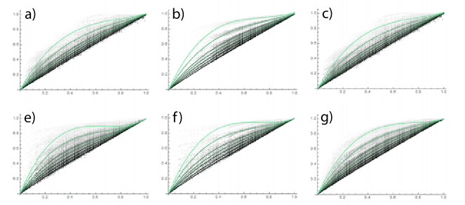
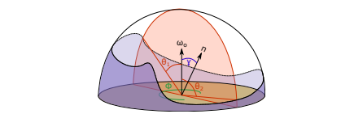

<head>
    
    
</head>  

`Practical Realtime Strategies for Accurate Indirect Occlusion`  
# 1 介绍
环境光遮蔽是一种对全局光照的近似，它对小遮挡物产生的阴影进行了建模。  
我们介绍了一系列新的屏幕空间的遮挡技术，目标是让实时的结果媲美光线追踪的ground truth结果。我们提出了一个新颖的AO技术，叫做GTAO，它将AO和近距离的间接光照分离(什么意思？)。这使我们能够通过避免分段积分（在使用遮挡估计器时需要）来有效地解决环境遮挡积分，同时通过使用有效的基于物理的函数近似来恢复丢失的多个散射漫射照明。     
我们的贡献是：  
* `GTAO：`一种高效的环境光遮蔽技术，可媲美radiometrically-correct的环境光遮蔽积分，并使用简单的封闭形式分析表达式将因近距离间接照明而损失的能量纳入其中。
* `Directional GTAO：`
* `Specular occlusion(SO)：`
* `GTSO：` 
# 3 Background & Overview
来自点$x$的反射辐射度$L_r(x,\omega _o)$可以被建模为：  
$$
L_r(x,\omega _o)=\int _{H^2}L(x,\omega _i)f_r(x,\omega _i,\omega _o)max(dot(n,\omega _i))d\omega _i
$$  
环境光遮蔽[ZIK98]近似了这个公式，通过介绍一系列假设  
* 所有$x$周围的表面是完全吸收的(并不反弹光)
* 所有的光来自于无限远的均匀白色环境光
* 位于$x$的表面是一个`Lambertian`表面  
得到了以下结果  
$$
L_r(x,\vec{\omega _o})=L_i\frac{\rho (x)}{\pi}A(x)\int _{H^2}V(x,\vec{\omega _i})cos(\vec n,\vec {\omega _i})d\vec{\omega _i}=
$$  
其中  
* $A(x)$是位置$x$的环境光遮蔽项
* $\frac{\rho (x)}{\pi}$是反照率为$\rho (x)$的漫反射BRDF
* $V(x,\omega _i)$是位置$x$在方向$\omega _i$上的可见性项
* 之前的文章将可见性项$V(x,\omega _i)$建模为一个衰减函数，这个函数相关于到遮挡物的距离  
# 4 GTAO
为了开发出一个高效的考虑邻域间接光的模型，我们发现了一个关键点，在总的AO、表面反照率、从$x$反射的间接光之间有一个关系，如图2所示。  

   

`图2`：x轴是AO，y轴是全局光，不同曲线表示不同反照率。一个三次多项式(绿色)和数据比较相符，意味着一个AO和GI之间的关系。我们在`4.2`研究这种关系  
这种关系带来了两个主要的好处:  
* 1 我们基于物理上合理的近似来模拟相互反射，而不是启发式模糊项
* 2 消除经验模糊项允许我们通过去除分段内部积分来降低复杂性，因此，每个方向执行一次计算，而不是每个样本一次。  
## 4.1 计算AO
我们的AO公式遵循 Bavoil 的基于视界的方法，这种方法使用计算公式如下  
$$
A(x)=\frac{1}{\pi}\int _0^{\pi}\int _{-\frac{\pi}{2}}^{\frac{\pi}{2}}V(\phi,\theta)cos(\theta - \gamma)^{+}|sin(\theta)|d\theta d\phi
$$  
其中，  
* $\theta$是沿着(?)视方向$\omega _0$
* $\gamma$是法线$\vec{n}$和视方向$\omega _0$之间的夹角
* $cos(\theta)^{+}=max(cos(\theta), 0)$
* $V(\phi,\theta)$是可见性衰减函数  
注意着不像HBAO，这个积分写成了辐射度量正确的形式，考虑了透视系数。这个坐标系也做出了修改，改为以相对于视方向$\omega _0$的$(\phi,\theta)$而不是切向量，这意味着需要$abs$。考虑一个二元可见性函数$V(\phi, \theta)$，当$\theta$在水平角$\theta _1(\phi)$和$\theta _2(\phi)$上方时返回 1，反之为 0(见`图3`)。  

  

`图3：`  
因此没有逐采样的衰减，由此公式可以写成  
$$
A(x)=\frac{1}{\pi}\int _{0}^{\pi}\underbrace{\int _{\theta _1(\phi)} ^{\theta _2(\phi)}cos(\theta - \gamma)^+|sin(\theta)|d\theta}_{\hat{a}} d\phi
$$   
根据给定的水平角$\theta _1$和$\theta _2$我们能通过如下公式计算积分$\hat{a}$  
$$
\hat{a}(\theta _1, \theta _2, \gamma)=\frac{1}{4}(-cos(2\theta _1-\gamma)+cos(\gamma)+2\theta _1sin(\gamma))\\
+\frac{1}{4}(-cos(2\theta _2-\gamma)+cos(\gamma)+2\theta _2sin(\gamma))
$$   
