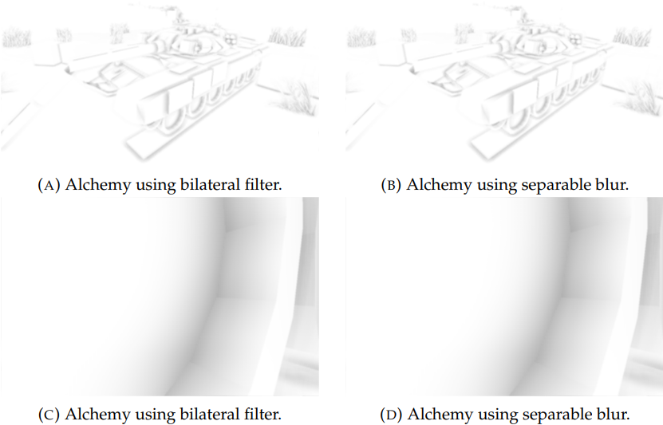

## GDC12-BF3
[原文](https://developer.nvidia.com/sites/default/files/akamai/gamedev/files/gdc12/GDC12_Bavoil_Stable_SSAO_In_BF3_With_STF.pdf)  
spatial filter方面也是两次1D的双边滤波，采样的时候用线性采样搞了个自适应采样
## Particle Shadows & Cache-Efficient Post-Processing
[原文](https://developer.nvidia.com/sites/default/files/akamai/gamedev/docs/BAVOIL_ParticleShadowsAndCacheEfficientPost.pdf)  
搞了个`Interleaved Rendering`交错渲染，可以做出大范围的过滤，纹理命中率高
## Ambient-Occlusion-on-Mobile-An-Empirical-Comparison
### 3.3.2 可分离模糊
这里引用了一个[可分离的双边滤波](https://www.researchgate.net/publication/4181202_Separable_bilateral_filtering_for_fast_video_preprocessing)，做了个近似，然后可以像高斯滤波那样分两步来做滤波  
先像通常的双边滤波那样在 x轴上过滤：  
$$
I^{'}_p = \frac{1}{W_p}\sum_{q\in X}G_{\sigma s}(||p-q||)G_{\sigma r}(|D_q-D_p|)I_q
$$  
此处的$X$是以$p$为中心的像素条带  
然后再在Y轴上做一遍  。。。。  
说是这种近似用在AO上效果还行，那就还行吧  

### 5.7 Bilateral Filter and Separable Blur 双边滤波和可分离模糊

测试了双边滤波和可分离模糊的性能，用的是他们的`Alchemy ambient obscurance`，测试之后说是效果差异不大，尤其在移动端的高分辨率下。  

    

时间上双边滤波15.87ms，可分离模糊6.76ms，不过不清楚他的具体实现就是了。 