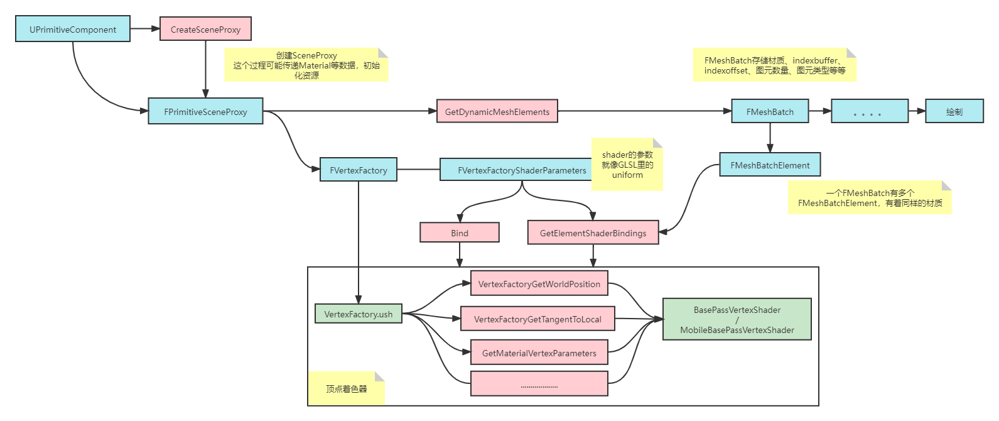
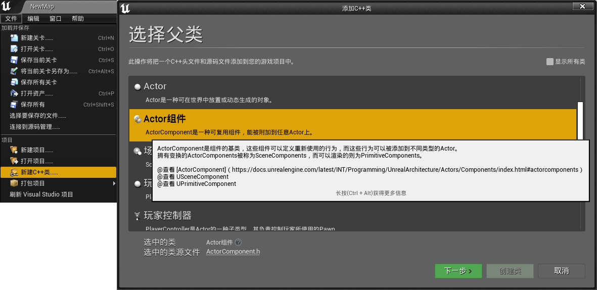
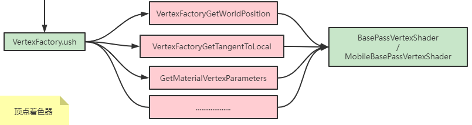

目的是要在插件中写一个primitive component，要包括自定义的vertex shader，通常来说意味着新的vertex factory   
基本上参考`LocalVertexFactory`、`StaticMeshComponent`来写即可，如果出现问题，很可能是没有实现父类的函数。

<div align=center><div>大致的结构</div></div>   

# Build.cs
用到的依赖需要写在这里  
* Core
* CoreUObject
* Engine
* RHI
* RenderCore
* Renderer  
* Projects  

比较常用

# 创建组件
在编辑器中上方 `文件`按钮下，`新建c++类`，选择`Actor组件`，路径选到插件目录中，之后相关文件就自动创建好了。  

<div align=center><div>防止老年痴呆，之前我找了半天没找到按钮</div></div>   

虽然个人想要的是一个直接继承`UPrimitiveComponent`的组件，但无大碍，直接改掉就好  
```
/**
 * PrimitiveComponents are SceneComponents that contain or generate some sort of geometry, generally to be rendered or used as collision data.
 * There are several subclasses for the various types of geometry, but the most common by far are the ShapeComponents (Capsule, Sphere, Box), StaticMeshComponent, and SkeletalMeshComponent.
 * ShapeComponents generate geometry that is used for collision detection but are not rendered, while StaticMeshComponents and SkeletalMeshComponents contain pre-built geometry that is rendered, but can also be used for collision detection.
 */
```    
```cpp
UMyComponent::UMyComponent()
{
	PrimaryComponentTick.bCanEverTick = true;
	bTickInEditor = true;
}
```
## bound
将组建绘制到屏幕上，首先要经过cpu的视锥剔除，要定制包围和的话，就要实现`CalcBounds`函数。先写个简单的。  
```cpp
//比如这么写的话，基本上一定会在视锥内
FBoxSphereBounds UMyComponent::CalcBounds(const FTransform& LocalToWorld) const
{
	return FBoxSphereBounds(LocalToWorld.GetLocation(), FVector(1000000.0f, 1000000.0f, 1000000.0f), 1000000.0f);
}
```
## SceneProxy
SceneProxy存储了用来渲染的信息，比如材质、顶点工厂等等  
其中重要的就是`GetDynamicMeshElements`函数，这个函数会创建`MeshBatch`，收集网格信息。MeshBatch随后会变成command，最后变成提交的绘制指令(drawindexed等等)  
```cpp
//组件类中实现这样的函数
FPrimitiveSceneProxy* UMyComponent::CreateSceneProxy()
{
	return new UMySceneProxy(this);
}
```  
```cpp
//一些实现SceneProxy还要实现的函数
SIZE_T GetTypeHash() const override
{
    static size_t UniquePointer;
    return reinterpret_cast<size_t>(&UniquePointer);
}

virtual uint32 GetMemoryFootprint(void) const override { return(sizeof(*this) + GetAllocatedSize()); }

uint32 GetAllocatedSize(void) const { return(FPrimitiveSceneProxy::GetAllocatedSize()); }

FMySceneProxy(const UMyComponent* InComponent)
	: FPrimitiveSceneProxy(InComponent)
	, VertexFactory(GetScene().GetFeatureLevel(), "MyVertexFactory")
{
	ENQUEUE_RENDER_COMMAND(Init)(
		[this](FRHICommandListImmediate& RHICmdList)
		{
			VertexFactory.InitResource();
		});
}

~FMySceneProxy() 
{
	VertexFactory.ReleaseResource();
}
```
## VertexFactory
看起来就像一个封装了的vertex shader，还包括相关资源的处理。由于包含了vertex shader，所以需要将插件的`.uplugin`中的`LoadingPhase`设置为`PostConfigInit`  

先搞一个简单的，参考`LocalVertexFactory.cpp`，实现下面的函数  
```cpp
class PLUGIN_API FMyVertexFactory : public FVertexFactory {
	DECLARE_VERTEX_FACTORY_TYPE(FMyVertexFactory);
public:

	FMyVertexFactory(ERHIFeatureLevel::Type InFeatureLevel, const char* InDebugName)
		: FVertexFactory(InFeatureLevel) {
	}

	static bool ShouldCompilePermutation(const FVertexFactoryShaderPermutationParameters& Parameters);

	static void ModifyCompilationEnvironment(const FVertexFactoryShaderPermutationParameters& Parameters, FShaderCompilerEnvironment& OutEnvironment);

	static void ValidateCompiledResult(const FVertexFactoryType* Type, EShaderPlatform Platform, const FShaderParameterMap& ParameterMap, TArray<FString>& OutErrors);

	// FRenderResource interface.
	virtual void InitRHI() override {}
	virtual void ReleaseRHI() override {}
};


IMPLEMENT_VERTEX_FACTORY_TYPE_EX(FMyVertexFactory, "{shader路径}", true, true, true, true, true, true, true);
```  
通常VertexFactory存储在SceneProxy上面  
此处有一个问题，事实上我们只想让必要的材质编译这个vertexfactory对应的变体，否则可能增加一个`VertexFactory`就要增加一份shader，即使这个材质永远不会用到这个`VertexFactory`  
然而材质看起来不提供自定义标注的功能。。  
在早一些的版本，ShouldCompilePermutation能够访问到材质，但是新的版本中得到的是`FVertexFactoryShaderPermutationParameters`，如果修改其中的结构体的话，又有些丧失了创建插件的意义，意味着难以将插件分享给别人  
## VertexFactory-Shader  
新建一个路径，存放新建的shader  
```cpp
#include "Interfaces/IPluginManager.h"
void FXXXXModule::StartupModule()
{
    //实际路径，通常都是在 /插件名/Shaders/ 下，所以这么写，直接写死字符串应该也行
    RealShaderDirectory = FPaths::Combine(
        IPluginManager::Get().FindPlugin(TEXT("插件名"))->GetBaseDir(),
        TEXT("Shaders")
    );
    //虚拟路径，代码中使用的路径
    VirtualShaderDirectory = ...
    //映射
    AddShaderSourceDirectoryMapping(VirtualShaderDirectory, RealShaderDirectory);
}
```  
通常在`IMPLEMENT_VERTEX_FACTORY_TYPE_EX`用到的shader文件以`ush`结尾，为BasePassShader提供一些函数、一些结构体声明  
<div align=center><div>VertexFactory.ush和顶点着色器的关系</div></div>   


## MeshBatch
先写出比较简单的部分  

关于MeshBatch，可以看大佬写的 [剖析虚幻渲染体系（03）- 渲染机制](https://www.cnblogs.com/timlly/p/14588598.html#322-%E4%BB%8Efprimitivesceneproxy%E5%88%B0fmeshbatch)  
接下来编写`GetDynamicMeshElements`函数  
```cpp
//通常是这样的形式
for (int32 ViewIndex = 0; ViewIndex < Views.Num(); ViewIndex++)
{
    if (VisibilityMap & (1 << ViewIndex))
    {
        FMeshBatch& Mesh = Collector.AllocateMesh();
    
        //填充FMeshBatch

        FMeshBatchElement& BatchElement = Mesh.Elements[0];

        //填充BatchElement

        Collector.AddMesh(ViewIndex, Mesh);
    }
}
```