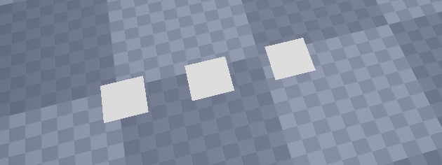
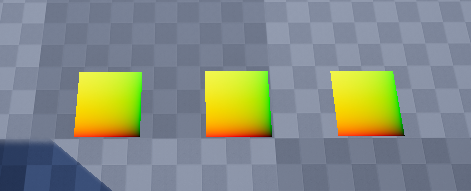
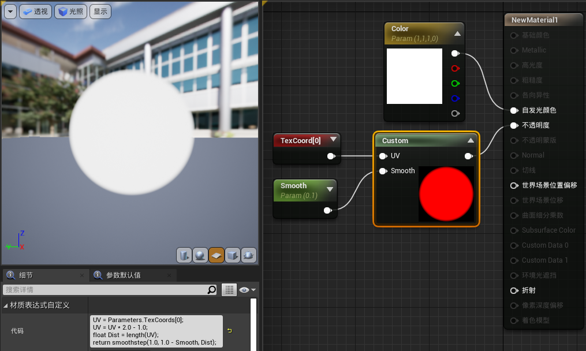
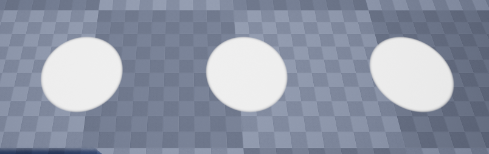
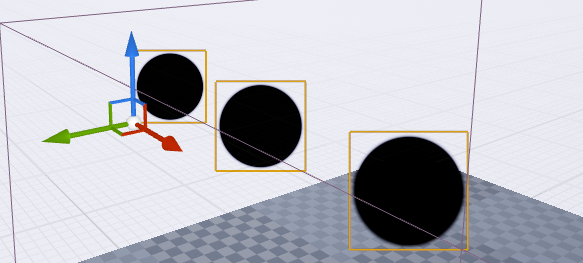
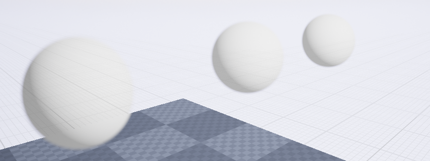

显然只绘制点是难以用肉眼看出来的，所以用Point+几何着色器输出成更大的图元就更为合理  
然而，在这里插入一个GS何其困难，更别提在插件中完成  
所以使用更为通用的方案，在顶点阶段绘制矩形来可视化一个点。考虑到方便观察这个矩形，要面向摄像头，并提供TexCoords插值，方便给材质使用。  
# 绘制矩形
没什么难的，但要注意一些地方。  
```cpp
//改成使用PT_TriangleList绘制三角形
Mesh.Type = PT_TriangleList;

//此处的NumPrimitives是图元的数量，在这里对应三角形的数量，而不是像上一章对应顶点的数量
//在后面调用图形api时，还是会转换成为6*3=18个顶点
//因此此处对应 3个矩形
BatchElement.NumPrimitives = 6;
```  
VertexFactory.ush中
```cpp
void SetupVertex(uint VertexIndex, out float3 OutPosition)
{
	//因为用的是PT_TriangleList，所以6个顶点一个矩形
    //如果担心顺序不对导致被面剔除掉，可以直接用twoside材质
	float3 RectVertex[6] = {
		float3(0.0, 0.0, 0.0),
		float3(0.0, 1.0, 0.0),
		float3(1.0, 1.0, 0.0),
		float3(0.0, 0.0, 0.0),
		float3(1.0, 1.0, 0.0),
		float3(1.0, 0.0, 0.0)
	};
	
	MyVertex Vertex = MyStructureBuffer[VertexIndex / 6];

	float3 Position = Vertex.Position;
	Position += RectVertex[VertexIndex % 6] * 5.0;

	OutPosition = Position;
}

FVertexFactoryIntermediates GetVertexFactoryIntermediates(FVertexFactoryInput Input)
{
	FVertexFactoryIntermediates Intermediates;

	SetupVertex(Input.VertexId, Intermediates.Position);

	return Intermediates;
}

float4 VertexFactoryGetWorldPosition(FVertexFactoryInput Input, FVertexFactoryIntermediates Intermediates)
{
	return TransformLocalToTranslatedWorld(Intermediates.Position);
}
```  

<div align=center><div>通过计算着色器输出了3个位置到Buffer，然后绘制了3个矩形在这三个位置上</div></div>   


# 提供TexCoords给PixelShader
```cpp
//在插值中增加TexCoords
struct FVertexFactoryInterpolantsVSToPS
{
#if NUM_MATERIAL_TEXCOORDS_VERTEX
	float4 TexCoords : TEXCOORD0;
#endif
};

struct FVertexFactoryIntermediates
{
	float3 Position;

	float4 TexCoords;
};

FVertexFactoryIntermediates GetVertexFactoryIntermediates(FVertexFactoryInput Input)
{
	FVertexFactoryIntermediates Intermediates;

	uint VertexIndex = Input.VertexId;

	//因为用的是PT_TriangleList，所以6个顶点一个矩形
	float3 RectVertex[6] = {
		float3(0.0, 0.0, 0.0),
		float3(0.0, 1.0, 0.0),
		float3(1.0, 1.0, 0.0),
		float3(0.0, 0.0, 0.0),
		float3(1.0, 1.0, 0.0),
		float3(1.0, 0.0, 0.0)
	};
	
	MyVertex Vertex = MyStructureBuffer[VertexIndex / 6];

	float3 Position = Vertex.Position;
	Position += RectVertex[VertexIndex % 6] * 5.0;

	Intermediates.Position = Position;

	Intermediates.TexCoords.xy = RectVertex[VertexIndex % 6].xy;

	//因为用的是float4，不初始化的话报错
	Intermediates.TexCoords.zw = 0;

	return Intermediates;
}

FVertexFactoryInterpolantsVSToPS VertexFactoryGetInterpolantsVSToPS(FVertexFactoryInput Input, FVertexFactoryIntermediates Intermediates, FMaterialVertexParameters VertexParameters)
{
	FVertexFactoryInterpolantsVSToPS Interpolants;

	Interpolants = (FVertexFactoryInterpolantsVSToPS)0;
	
    //插值
	#if NUM_MATERIAL_TEXCOORDS_VERTEX
	Interpolants.TexCoords = Intermediates.TexCoords;
	#endif
	
	return Interpolants;
}

//这里是PixelShader的函数
FMaterialPixelParameters GetMaterialPixelParameters(FVertexFactoryInterpolantsVSToPS Interpolants, float4 SvPosition)
{
	// GetMaterialPixelParameters is responsible for fully initializing the result
	FMaterialPixelParameters Result = MakeInitializedMaterialPixelParameters();

#if NUM_MATERIAL_TEXCOORDS_VERTEX
	Result.TexCoords[0] = Interpolants.TexCoords.xy;
#endif

	return Result;
}

```
<div align=center><div>每个矩形都能获得uv了</div></div>   

既然能得到uv，则可以用来画圆，或者球  
<div align=center></div>  

<div align=center></div>  

```cpp
//若换成半透明失效，可能是FPrimitiveViewRelevance错了
virtual FPrimitiveViewRelevance GetViewRelevance(const FSceneView* View) const override 
{
    FPrimitiveViewRelevance Relevance;
    Relevance.bDrawRelevance = true;
    Relevance.bDynamicRelevance = true;
    Relevance.bRenderInMainPass = true;

    //通过材质的类型来得到ViewRelevance
    //MaterialRelevance = MaterialInterface->GetRelevance_Concurrent(...);
    MaterialRelevance.SetPrimitiveViewRelevance(Relevance);
    return Relevance;
}
```
# 面向摄像机
绘制的三个矩形位置没问题，但是平行于地面，看着费劲，所以让他们变成朝向摄像机。   
这个需求一听就熟悉，不就是Billboard吗。  

将前面的Shader代码做出修改
```cpp
float3 RectVertex[6] = {
    float3(0.0, 0.0, 0.0),
    float3(0.0, 1.0, 0.0),
    float3(1.0, 1.0, 0.0),
    float3(0.0, 0.0, 0.0),
    float3(1.0, 1.0, 0.0),
    float3(1.0, 0.0, 0.0)
};

float3 Offset = RectVertex[VertexIndex % 6];

//根据摄像机的Right和Up来计算位置， 5.0随便写的
Position += (Offset.x * ResolvedView.ViewRight + Offset.y * ResolvedView.ViewUp) * 5.0;
```  

<div align=center></div>  


这样矩形就和摄像机相关，方便肉眼查看。  
之后再怎么细化这个Point就和VertexFactory没什么关系了，连连看缺什么参数的话，再VertexFactory中传入就好  

<div align=center></div>  

也可以做的有立体感一些