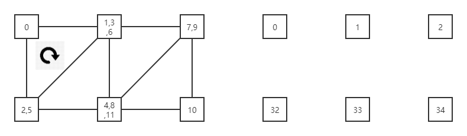
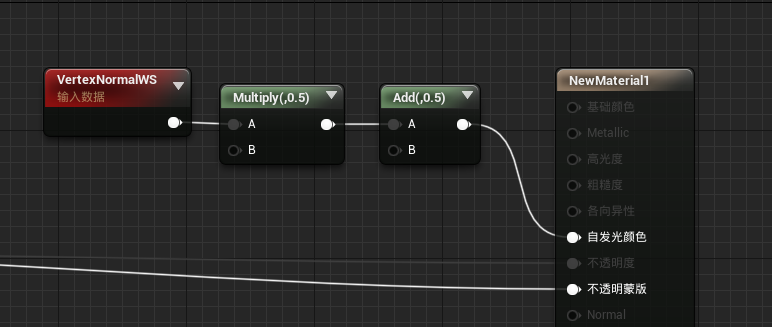
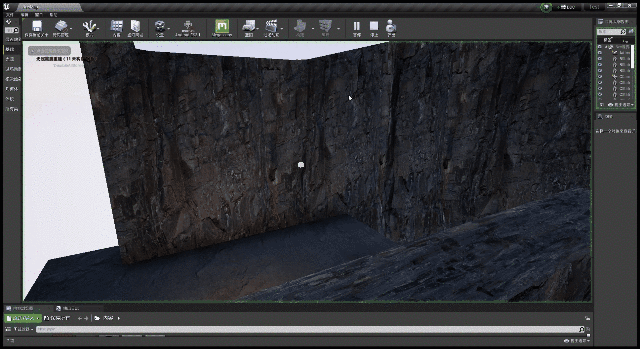
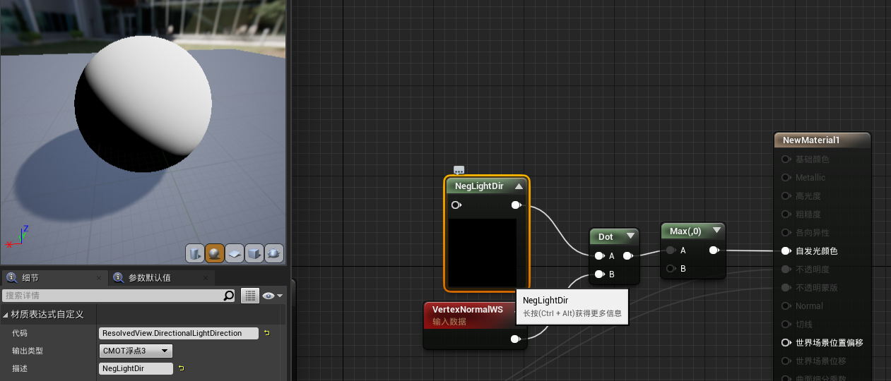
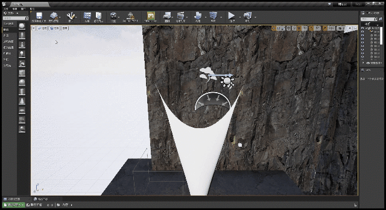

当然不可能只是绘制Debug用的粒子就满足了  
这次来绘制一个布料的网格。 
假设我们有两个Buffer，一个是位置，另一个是法线，这样我们就能基于简单的漫反射模型计算光照。  
本文其实为了自己的[物理模拟练习](https://zhuanlan.zhihu.com/p/449897373)  服务，位置和法线都是ComputeShader算出来的。  

# 绘制网格
在XXXVertexFactory.ush中，这么声明Buffer
```cpp
Buffer<float4> PositionBuffer;
Buffer<half4> NormalBuffer;
```  


然后在cpp中绑定、传值
```cpp
class FPhysicsVertexFactoryShaderParametersVS : public FVertexFactoryShaderParameters
{
	DECLARE_INLINE_TYPE_LAYOUT(FPhysicsVertexFactoryShaderParametersVS, NonVirtual);
public:

    //绑定，TEXT("PositionBuffer")和上面ush中的Buffer名字一样
	void Bind(const FShaderParameterMap& ParameterMap)
	{
		PositionBufferParameter.Bind(ParameterMap, TEXT("PositionBuffer"));
		NormalBufferParameter.Bind(ParameterMap, TEXT("NormalBuffer"));
	}

	void GetElementShaderBindings(
		const FSceneInterface* Scene,
		const FSceneView* View,
		const FMeshMaterialShader* Shader,
		const EVertexInputStreamType InputStreamType,
		ERHIFeatureLevel::Type FeatureLevel,
		const FVertexFactory* VertexFactory,
		const FMeshBatchElement& BatchElement,
		class FMeshDrawSingleShaderBindings& ShaderBindings,
		FVertexInputStreamArray& VertexStreams) const
	{
		FPhysicsVertexFactory* VF = (FPhysicsVertexFactory*)VertexFactory;
		ShaderBindings.Add(Shader->GetUniformBufferParameter<FPhysicsUniformParameters>(), VF->GetUniformBuffer());

        //传值，将Buffer的SRV传给Shader
		ShaderBindings.Add(PositionBufferParameter, VF->PositionBuffer.SRV);
		ShaderBindings.Add(NormalBufferParameter, VF->NormalBuffer.SRV);
	}

	LAYOUT_FIELD(FShaderResourceParameter, PositionBufferParameter);
	LAYOUT_FIELD(FShaderResourceParameter, NormalBufferParameter);
};
```   

这样Shader就能读到Buffer中的值了。接下来绘制三角形。  
不同于上一章中Buffer的一个值对应一个Billboard，这次Buffer的一个值只是对应三角形一个顶点。  
每个Buffer有1024个元素，表示32x32个顶点，意味着要绘制成31x31的网格，也就是`31x31x2=1922`个三角形。  
因此我们在cpp代码的`GetDynamicMeshElements`函数中有  
```cpp
FMeshBatchElement& BatchElement = Mesh.Elements[0];
BatchElement.NumPrimitives = 31 * 31 * 2;
```

接下来考虑如何用`SV_VertexID`读取Buffer  


<div align=center><div>左侧的数字是顶点着色器中的VertexID；右侧的数字是Buffer的ID</div></div>  

```cpp
//XXXVertexFactory.ush
uint RectVertex[6] = {0, 1, 32, 1, 33, 32};
uint IndexInRect = VertexIndex % 6;
uint RectIndex = VertexIndex / 6;

uint Col = RectIndex % 31;
uint Row = RectIndex / 31;

uint BufferIndex = RectVertex[IndexInRect] + RectIndex + Row;
float3 Position = PositionBuffer[BufferIndex].xyz;
float3 Normal = NormalBuffer[BufferIndex].xyz;

Intermediates.Position = Position;
Intermediates.Normal = Normal;

//此处的UV只是为了适应上一章中的`画圆`材质罢了
Intermediates.TexCoords.xy = float2(0.5, 0.5);
```  

<div align=center><div>仅仅绘制三角形，还未利用法线</div></div>

# 法线
在顶点着色器得到了法线，还需要插值给像素着色器  
```cpp
//插值结构体
struct FVertexFactoryInterpolantsVSToPS
{
    //添加法线切线相关的插值，这个宏是引擎自带的
	//位于Common.ush
    //#define TANGENTTOWORLD_INTERPOLATOR_BLOCK	MaterialFloat4 TangentToWorld0 : TANGENTTOWORLD0; MaterialFloat4	TangentToWorld2	: TANGENTTOWORLD2;
    //不用这个宏，自己定义一个插值项也可以
    TANGENTTOWORLD_INTERPOLATOR_BLOCK

#if NUM_MATERIAL_TEXCOORDS_VERTEX
	float4 TexCoords : TEXCOORD0;
#endif
};

FVertexFactoryInterpolantsVSToPS VertexFactoryGetInterpolantsVSToPS(FVertexFactoryInput Input, FVertexFactoryIntermediates Intermediates, FMaterialVertexParameters VertexParameters)
{
	FVertexFactoryInterpolantsVSToPS Interpolants;

	Interpolants = (FVertexFactoryInterpolantsVSToPS)0;
	
#if NUM_MATERIAL_TEXCOORDS_VERTEX
	Interpolants.TexCoords = Intermediates.TexCoords;
#endif
	
    //TangentToWorld2是TANGENTTOWORLD_INTERPOLATOR_BLOCK宏定义的
	Interpolants.TangentToWorld2 = float4(Intermediates.Normal, 1.0);

	return Interpolants;
}

FMaterialPixelParameters GetMaterialPixelParameters(FVertexFactoryInterpolantsVSToPS Interpolants, float4 SvPosition)
{
	// GetMaterialPixelParameters is responsible for fully initializing the result
	FMaterialPixelParameters Result = MakeInitializedMaterialPixelParameters();

#if NUM_MATERIAL_TEXCOORDS_VERTEX
	Result.TexCoords[0] = Interpolants.TexCoords.xy;
#endif

    //从插值中获取法线
    //这里我们只给TangentToWorld这个3x3矩阵赋值一部分准确的值
    //因为TangentToWorld[2] 在UE中代表世界空间顶点法线
	//不要搞成Result.WorldNormal了
	Result.TangentToWorld = half3x3(
		half3(0.0, 0.0, 1.0),
		half3(0.0, 0.0, 1.0),
		Interpolants.TangentToWorld2.xyz
	);
	
	return Result;
}
```  

<div align=center><div>在材质编辑器中链接法线到输出</div></div>


<div align=center><div>法线输出了，接下来就能计算光照了</div></div>   


一般来说，对于延迟管线，光照是在LightPass计算的，而材质编辑器通常是表示BasePass，也就是输出属性到GBuffer的部分。因此通常不在材质编辑器计算光照，而是连到Normal输出中。  

不过还是有办法获取到光照方向的。  
<div align=center><div>Custom节点中的内容是ResolvedView.DirectionalLightDirection，这个是光照方向的逆方向</div></div>  

<div align=center><div>结果。。。</div></div>    