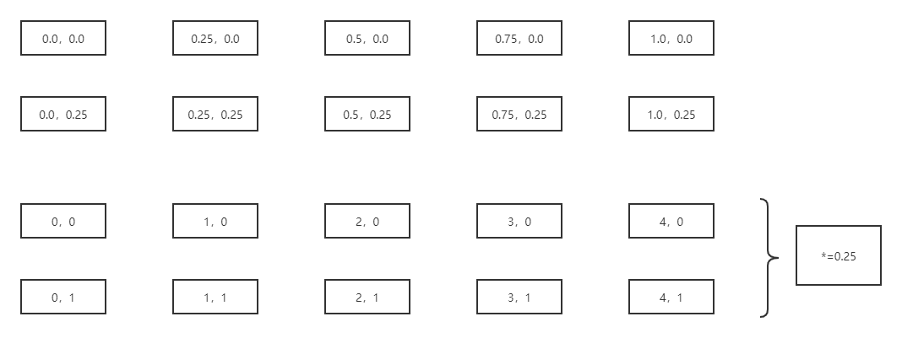
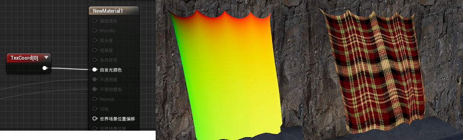

这次要让网格能够使用UV，并能采样切线空间的法线纹理

# UV

假设一个5x5的2D网格，他的UV可以这么表示
<div align=center><div>下面的两行是上面两行乘0.25，也就是1/(n-1)</div></div>  


```cpp
//基本上是在前文的基础上添加
FVertexFactoryIntermediates GetVertexFactoryIntermediates(FVertexFactoryInput Input)
{
	FVertexFactoryIntermediates Intermediates;
	Intermediates = (FVertexFactoryIntermediates)0;

	uint VertexIndex = Input.VertexId;

    uint IndexInRect = VertexIndex % 6;
    uint RectIndex = VertexIndex / 6;

    uint Col = RectIndex % 31;
    uint Row = RectIndex / 31;

    //无论是31还是1/31，正常是cpp计算然后传入
    const float Scale = 1.0 / 31.0;
    const float2 RectUV[6] = {
        float2(0.0, 0.0),
        float2(1.0, 0.0),
        float2(0.0, 1.0),
        float2(1.0, 0.0),
        float2(1.0, 1.0),
        float2(0.0, 1.0)
    };

    float2 UV = RectUV[IndexInRect];
    UV.x += Col;
    UV.y += Row;
    UV *= Scale;

    Intermediates.TexCoords.xy = UV;

    //...略
}
```  
UV不在VS里面计算，而是用VertexBuffer传递也没问题

<div align=center><div>中: 输出UV0；右: 采样纹理。结果没什么问题</div></div>  

# 法线纹理
现在游戏中用到的法线纹理都是在切线空间的，所以我们在使用时，要将其转为世界空间，也就是说需要一个`TangentToWorld`矩阵。  
