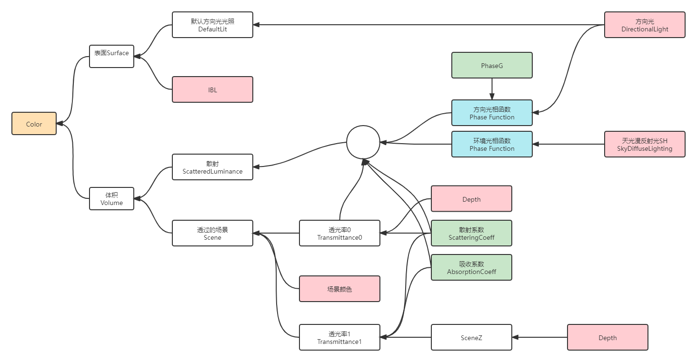
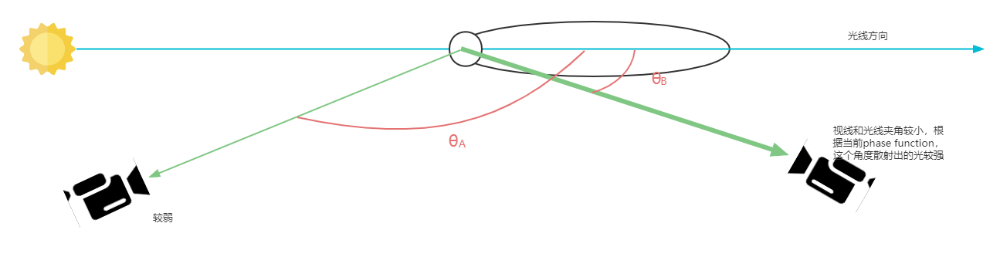
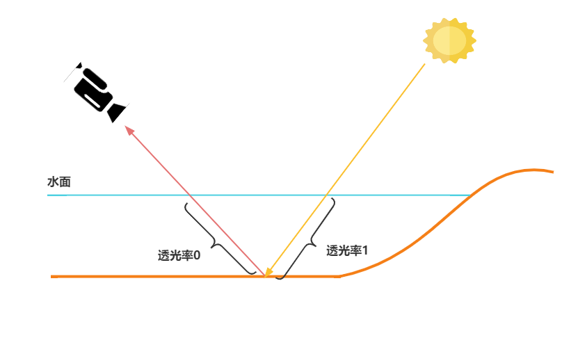

# 大概结构
<div align=center><div>一般的光照都是只有surface部分且加上天光漫反射</div></div>    


# Phase Function
`Phase Function`描述了体积对不同方向的散射强度，根据参数，可能所有方向都一致；也有可能是和光线入射方向一致的方向很强，其他方向很弱   

<div align=center><div>右边的摄像机接收的散射强度大</div></div>    


下面是UE中的代码
```cpp
//各项同性
float IsotropicPhase()
{
	return 1.0f / (4.0f * PI);
}

float DirLightPhaseValue = 0.0f; // Default when Total Internal Reflection happens.
{
#if SIMPLE_SINGLE_LAYER_WATER
    DirLightPhaseValue = IsotropicPhase();
#else
    float IorFrom = 1.0f; // assumes we come from air
    float IorTo   = DielectricF0ToIor(DielectricSpecularToF0(Specular)); // Wrong if metal is set to >1. But we still keep refraction on the water surface nonetheless.
    const float relativeIOR = IorFrom / IorTo;
    float3 UnderWaterRayDir = 0.0f;
    if (WaterRefract(MaterialParameters.CameraVector, MaterialParameters.WorldNormal, relativeIOR, UnderWaterRayDir))
    {
        DirLightPhaseValue = SchlickPhase(PhaseG, dot(-ResolvedView.DirectionalLightDirection.xyz, UnderWaterRayDir));
    }
#endif
}
```  
这里提到了两个相函数(phase function)
## Isotropic 各项同性
既然这个是常数$\frac{1}{4\pi}$，也就代表这各个方向的散射程度是相同的、均匀的。  
## Schlick
这个phase function是另一个函数henyey-greenstein的近似  
henyey-greenstein的公式是  
$$
p(\theta, g)=\frac{1-g^2}{4\pi (1+g^2-2g\cos \theta)^{1.5}}
$$
此处的g根据取值可以达到不同效果  
* g > 0 是forward，出射方向和入射方向较相近的话会更强
* g = 0 代表各项同性，公式也就成了$\frac{1}{4\pi}$
* g < 0 是backward

而对这种函数的近似就是Schlick，他的公式是
$$
p(\theta , k)=\frac{1-k^2}{4\pi (1+k\cos\theta)^2}, \ \ \ \ \ \ \ k\approx 1.55g-0.55g^3
$$  

在UE中，这里的`phase function`得出的结果会和方向光相乘得到Sun散射  
```cpp
//移动端中，SunIlluminance是ResolvedView.DirectionalLightColor.rgb * PI;	
//times PI because it is divided by PI on CPU (=luminance) and we want illuminance here. 
//
float3 SunScattLuminance = DirLightPhaseValue * SunIlluminance;
```  
而环境光则会和各项同性的Phase相乘得到环境散射
```cpp
float3 AmbScattLuminance = IsotropicPhase()   * AmbiantIlluminance;
```
# Transmittance
## DepthFade
比较简单的实现衰减(水越深越暗)的方式是用材质编辑器中的`DepthFade`节点，然后给美术调参数  
`DepthFade`节点中的公式为  
$$
Opacity*Saturate(\frac{SceneDepth-PixelDepth}{FadeDistance})
$$  
SceneDepth相当于是水下不透明物体的深度，来自深度纹理(或FramebufferFetch)。  
PixelDepth是水面的深度，也就是水的网格体的深度。  
SceneDepth与PixelDepth相差越大，表示水深，表现'水本身的颜色'；相应的水越浅，alpha越低，越表现水下的SceneColor

## SingleLayerWater中的透光率Transmittance
顾名思义，表示的是透过光的强度，和上面的fade是相反的概念。  
在Shader中，存在两个不同的透光率，一个是沿着视线的透光率，另一个是沿着世界空间的z轴的透光率
$$
Transmittance_0=e^{-(Scatter+Absorption)*max(0,SceneDepth-WaterDepth)}\\
Transmittance_1=e^{-(Scatter+Absorption)*max(0,WaterTopZ - SceneZ)}\\
$$  
第一个比较好理解，当水下的场景反射的光线射出水面到眼睛的过程中要收到水的衰减。  
第二个透光率计算的原因是，在计算水下的场景，比如在之前渲染的不透明物体的时候，并没有计算入射光射入水体时的衰减，所以在这里要计算一遍。这个透光率是用水面的高度减去水下物体的高度。

<div align=center><div>读取到的SceneColor没有计算透光率1</div></div>    

# 体积光
有了散射和Transmittance，就能计算体积光的最终结果  
```cpp
float3 ScatteredLuminance = ScatteringCoeff * (AmbScattLuminance + SunScattLuminance * DirectionalLightShadow);

//Transmittance是上面提到的第一个透光率
ScatteredLuminance = (ScatteredLuminance - ScatteredLuminance * Transmittance) / ExtinctionCoeffSafe;  

//...

//BehindWaterSceneLuminance是SceneColor，如果不能获取SceneColor纹理的话，此处为0
Output.Luminance = WaterVisibility * (ScatteredLuminance + Transmittance * (BehindWaterSceneLuminance* ColorScaleBehindWater));
Output.WaterToSceneTransmittance = Transmittance;

//MeanTransmittanceToLightSources上面提到的第二个透光率
Output.WaterToSceneToLightTransmittance = Transmittance * MeanTransmittanceToLightSources;
```  
其中`WaterVisibility`就是`1-Opacity`  
`BehindWaterSceneLuminance`来自SceneColor

最后体积光加到最终结果上，如果是移动端根据透光率改变透明度，以此来混合SceneColor，也就是说BehindWaterSceneLuminance为0；如果不是移动端，则是通过SceneColor纹理来获取，并在计算水体体积光的时候混合。
```cpp
Color += WaterLighting.Luminance;
ShadingModelContext.Opacity = 1.0 - ((1.0 - ShadingModelContext.Opacity) * dot(WaterLighting.WaterToSceneToLightTransmittance, float3(1.0 / 3.0, 1.0 / 3.0, 1.0 / 3.0)));
```  
能够看出`WaterToSceneToLightTransmittance`是一个float3，而转为alpha就成了float。  


# 距离单位
rtr4中计算光学深度的时候用的是米，而UE用的是cm。这样会导致参数需要很小很小
# alpha
移动端中的alpha，一定不会为0，但事实上，最浅的地方应该是可以为0的
# 三维向量 vs 一维
由于各种原因，当前与scenecolor混合时，只能用alpha混合，这意味着只能是scenecolor减弱。而理想中，scenecolor的rgb分布也会随着水体颜色而发生变化