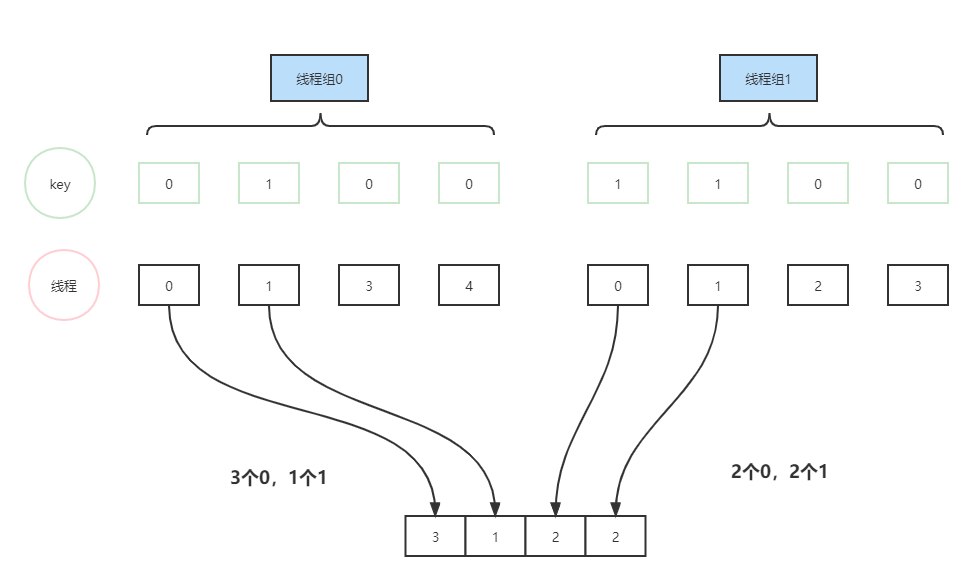
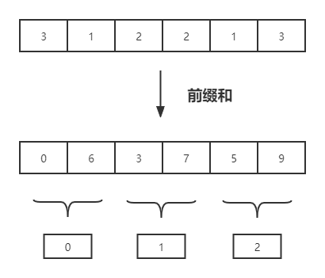
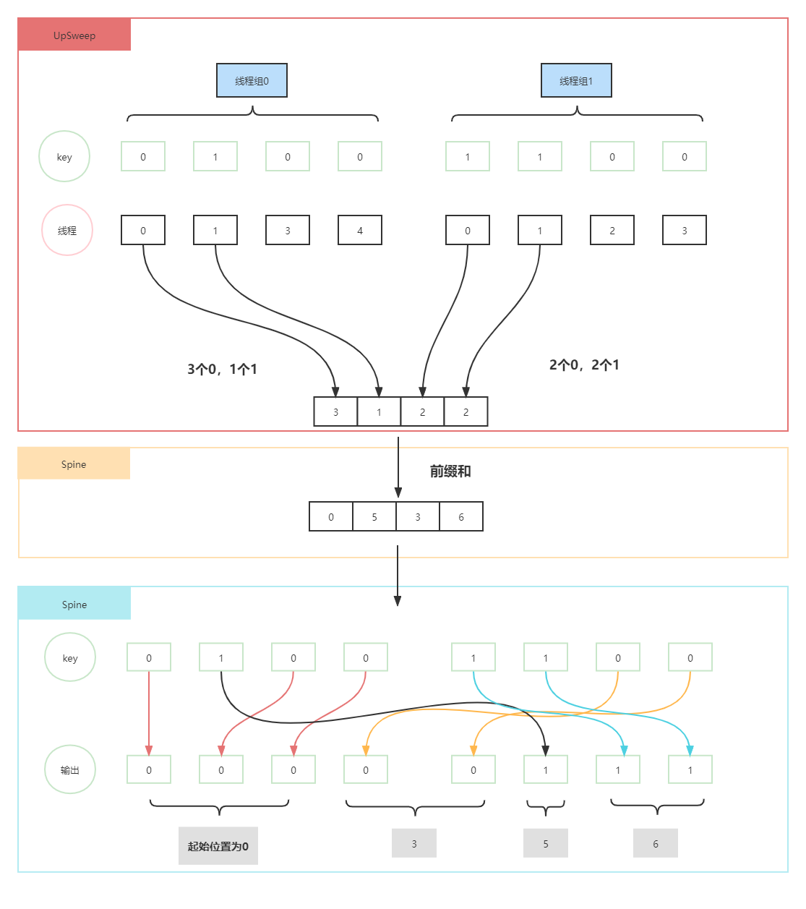

本文剖析一下UE引擎的GPU基数排序  
以前发了[UE4阅读笔记-Niagara&Warp指令](https://zhuanlan.zhihu.com/p/450586745)，本来是想试着用warp指令来实现一个技术排序，但是Shader中的warp指令是只有SM6才能用的，所以还是要使用shared memory来做一个方案     
各种实现的方案知乎上已经有人介绍了  
也可以去看[gpugems3](https://developer.nvidia.com/gpugems/gpugems3/part-vi-gpu-computing/chapter-39-parallel-prefix-sum-scan-cuda)
# 
核心的问题是如何找到某个元素的输出位置，求得同一种元素的起始输出位置，以及在起始输出位置上的偏移，加到一起就是最终的位置。而在GPU上，这些位置往往又是每一个线程组有自己的起始位置，并需要求前缀和。  

UE的实现分为多个'`pass`'，一个`pass`有三个部分，`UpSweep`、`spine`和`DownSweep`。  
我们可以每个pass只处理一个bit，也就是说，如果key是32bit，则需要32个pass才能排序完；也可以每个pass处理 4个bit，这样我们需要8个pass。  

当然也可以定义比32更小位数的key，可能需要更少的pass
```cpp
int32 GetGPUSortPassCount(uint32 KeyMask)
{
	const int32 BitCount = GPUSORT_BITCOUNT;		//GPUSORT_BITCOUNT == 32
	const int32 PassCount = BitCount / RADIX_BITS;	//RADIX_BITS == 4

	int32 PassesRequired = 0;

	uint32 PassBits = DIGIT_COUNT - 1;
	for (int32 PassIndex = 0; PassIndex < PassCount; ++PassIndex)
	{
		// Check to see if these key bits matter.
		if ((PassBits & KeyMask) != 0)
		{
			++PassesRequired;
		}
		PassBits <<= RADIX_BITS;
	}
	return PassesRequired;
}
```  

## 第一个部分 UpSweep
```
The upsweep sorting kernel. This kernel performs an upsweep scan on all tiles allocated to this group and computes per-digit totals. These totals are output to the offsets buffer.
```  
这个kernel统计出当前线程组中每一个不同`digit`的数量，并输出到`offsets buffer`。
此处的`digit`和每个pass处理的bit数量的关系是`DIGIT_COUNT = (1 << RADIX_BITS)`   
也就是说，如果每个pass处理4个bit的话，就有16个不同的digit，而在UpSweep中，要统计这些digit各自的数量。   
而`offsets buffer`存储所有线程组中，不同`digit`的数量，代码如下
```cpp
// 每个线程组中，只有线程Id小于digit数量的线程才输出
if ( ThreadId < DIGIT_COUNT )
{
	OutOffsets[GroupId * DIGIT_COUNT + ThreadId] = ...;
}
```  

<div align=center><div>排序长度为8的数组，分两个线程组，RADIX_BITS为1，只有0或1两种digit，那么每个线程组最终输两个值</div></div>  

## 第二个部分 Spine
```
The spine sorting kernel. This kernel performs a parallel prefix sum on the offsets computed by each work group in the upsweep. The outputs will be used by individual work groups during the downsweep to compute the final location of keys.
```
对UpSweep的输出结果计算前缀和。  
```cpp
DispatchComputeShader(RHICmdList, SpineCS.GetShader(), 1, 1, 1 );
```
能够看出，这个计算着色器的线程组只有一个。  


<div align=center><div>输入来自UpSweep三个线程组的输出，计算前缀和，这样在下一步DownSweep中就能得到对应线程组的某一种digit的输出起始位置</div></div>  

## 第三个部分 DownSweep
有了线程组中每一种digit的输出起始位置，那么只需要得到当前线程在同一种digit内的输出位置，就能得到当前pass的最终输出位置。
## 合并三个过程  
<div align=center></div>  

# Raking Scan
进一步解析代码  
UE这里采用的是一种叫`Raking Scan`的做法   
我在看代码的时候参考了[Reduce and Scan](https://moderngpu.github.io/scan.html)，但是看了好久也想不出来怎么翻译`raking`这个词，或许就叫扫射吧。  
给出的解释是  
```
The use of sequential operations in this parallel algorithm are called "raking reductions" and "raking scans," because they are computed within lanes rather than cooperatively over the lanes.
```    
大概是指，这种算法部分是sequential的，在`lanes`的内部进行计算，而不是`lane`间的协同。也就是强调了串行的部分。  
总的来说就是，一个线程会有很多串行的加和操作，这个加和操作不是指Reduction的那种$log_2N$的、金字塔状的、线程间协作操作，而是每个线程(Raking线程)独自的累加。按照默认的配制，一个`Raking Thread`会在循环中做32次加和(一个线程组128个线程，64个Raking线程，16种Digit，所以是16 * 128 / 64 = 32)。     


## Raking的UpSweep
这个CS可以分为两个部分  
`第一个部分`是每个线程独立的计数  
```cpp
groupshared uint LocalCounters[BANKS_PER_DIGIT * DIGIT_COUNT * PADDED_BANK_SIZE];
```  
声明了一个shared memory的数组`LocalCounters`，存储digit的计数，尺寸是`BANKS_PER_DIGIT * DIGIT_COUNT * PADDED_BANK_SIZE`。  
* `DIGIT_COUNT` 前面说过了，每个pass计算4个bit的话，`DIGIT_COUNT`就是16。  
* `PADDED_BANK_SIZE`，扩展了的bank的尺寸。这里的扩展是一种消除`bank conflict`的方式，`bank conflict`也有挺多文章讲的，比如  
[GPU CUDA 使用 memory padding 避免 bank conflict](https://zhuanlan.zhihu.com/p/436395393)  
在UE代码中，`PADDED_BANK_SIZE`就是`WORDS_PER_BANK + 1`也就是`32 + 1 = 33`。  
* `BANKS_PER_DIGIT` 每个digit对应多少个bank，算法是`COUNTERS_PER_DIGIT / WORDS_PER_BANK = THREAD_COUNT / WORDS_PER_BANK = 128 / 32 = 4(默认)`

可以认为，每个`digit`占有连续的`BANKS_PER_DIGIT * PADDED_BANK_SIZE = 4 * 33 = 132`大小的空间，如果不考虑bank conflict的话，就是`4 * 32 = 128`，也就是线程组中的线程数量，也就是说，每个线程都对应`DIGIT_COUNT = 16`大小的空间。也可以认为，16个digit，每个都有128个计数器(counter)。  
所以第一部分，就是每个线程独立的读取`N`个数据，并统计不同digit对应的数量，写入独立的sharedmemory里面。 默认情况下，`N=8`。   
```cpp
const uint BankOffset = ThreadId / (WORDS_PER_BANK);
const uint CounterOffset = ThreadId & (WORDS_PER_BANK - 1);		//WORDS_PER_BANK = 32

while ( GroupKeyBegin < GroupKeyEnd )
{
	//从Buffer中读取key
	const uint Key = InKeys[GroupKeyBegin + ThreadId];
	//转为Digit
	const uint Digit = (Key >> RadixSortUB.RadixShift) & DIGIT_MASK;
	//计算Bank的Index，也就是LocalCounters中16 * 4 * 33中16 * 4里面的序号
	const uint BankIndex = Digit * BANKS_PER_DIGIT + BankOffset;
	LocalCounters[BankIndex * PADDED_BANK_SIZE + CounterOffset] += 1;
	GroupKeyBegin += THREAD_COUNT;
}
```

默认情况下，这个循环进行8次。

`第二部分`是一个归约Reduction操作，也被称作Raking式的归约。和上面不同的一点是，上面是128个线程，而这里只用到64个线程(Raking线程)。所以默认是，4个Raking线程对应一个digit  
```cpp
// 根据线程Id获取Digit
uint GetRakingDigit( const uint ThreadId )
{
	if ( ThreadId < RAKING_THREAD_COUNT )				//RAKING_THREAD_COUNT = 64
	{
		return ThreadId / RAKING_THREADS_PER_DIGIT;		//RAKING_THREADS_PER_DIGIT = 4
	}
	else
	{
		return DIGIT_COUNT;
	}
}
```    
同样需要一块shared memory。  
```cpp
groupshared uint LocalRakingTotals[RAKING_COUNTERS_PER_DIGIT * DIGIT_COUNT + 1];
```  
首先每个Raking线程做了独立地对上一部分输出`LocalCounters`求和，由于上一部分是每个digit有128个Counter，而每4个Raking线程对应一个digit，所以每个Raking线程对自己的digit的128 / 4 = 32个Counter求和，并写入`LocalRakingTotals`。  
```cpp
uint Total = 0;
if ( ThreadId < RAKING_THREAD_COUNT )
{
	// Perform a serial reduction on this raking thread's counters.
	Total = LocalCounters[BankToRakeOffset];
	[unroll]
	for ( i = 1; i < COUNTERS_PER_RAKING_THREAD; ++i )
	{
		Total += LocalCounters[BankToRakeOffset + i];
	}

	// Place the total in the raking counter.
	LocalRakingTotals[RakingIndex] = Total;
}
```
这样原来每个digit的128个counter就变成了4个counter。  
那么接下来就是对这4个counter来归约。  
```cpp
for ( uint RakingOffset = 1; RakingOffset < RAKING_THREADS_PER_DIGIT; RakingOffset <<= 1 )
{
	PPS_BARRIER();
	Total += LocalRakingTotals[RakingIndex - RakingOffset];
	LocalRakingTotals[RakingIndex] = Total;
}
```  
这样就得到了当前线程组内，每一个digit的计数。  

读完这段代码之后，感觉就是串行计数、单线程归约、多线程归约的一个平衡，比naive的方式有了更多串行的计算。