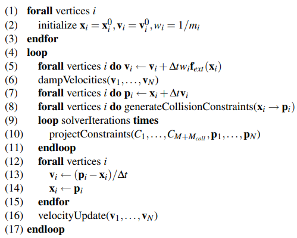
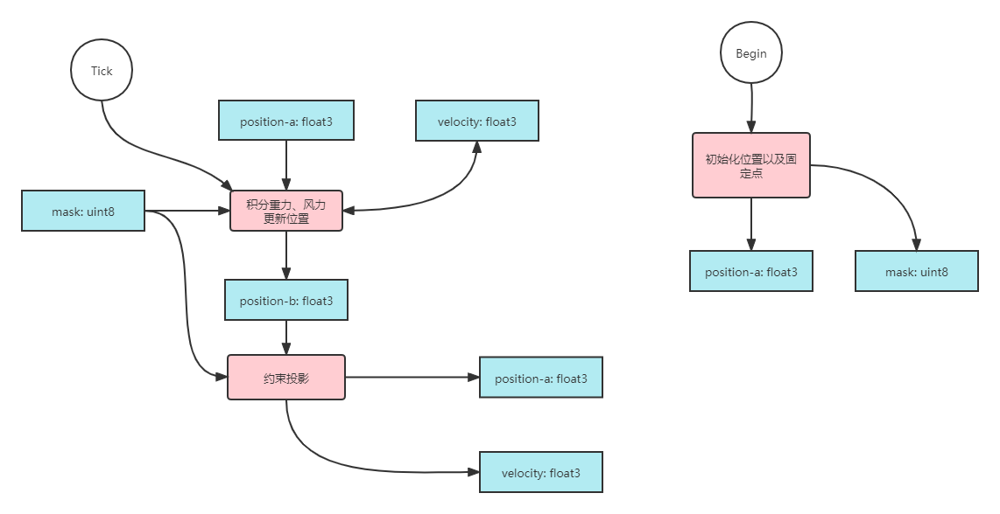
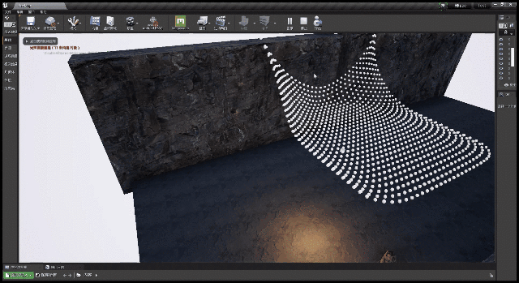

这周看了[Position Based Dynamics
](https://matthias-research.github.io/pages/publications/posBasedDyn.pdf)以及[Games103](https://www.bilibili.com/video/BV12Q4y1S73g?p=6)，打算在UE4里面实践一下。写一个基于ComputeShader的PBD布料模拟，先不考虑和其他物体碰撞，也先不考虑底层优化，只考虑重力。  
迭代方式选择雅可比，累计位移然后平均。

# 设计计算流程 & 数据流

<div align=center><div>论文中给出的伪代码，这次不需要计算碰撞</div></div>    

<div align=center><div>基本上就是 4个Buffer，3个计算程序。其中位置BufferA和B理论上可以只用一个Buffer。</div></div>    


# Buffer初始化
```cpp
FRWBuffer VertexMaskBuffer;
FRWBuffer PositionBufferA;
FRWBuffer PositionBufferB;
FRWBuffer VelocityBuffer;
```

```cpp
//因为要在ComputeShader里面写入，所以有BUF_UnorderedAccess 
VertexMaskBuffer.Initialize(
    sizeof(uint8)
    , VertexBufferLength
    , PF_R8_UINT
    , BUF_UnorderedAccess | BUF_ShaderResource
    , TEXT("SimVertexMaskBuffer")
    , nullptr   //内容在ComputeShader中初始化，所以传null
    );

//因为速度用的是PF_FloatRGBA，尺寸对应FFloat16Color
VelocityBuffer.Initialize(sizeof(FFloat16Color), VertexBufferLength, EPixelFormat::PF_FloatRGBA, BUF_UnorderedAccess | BUF_ShaderResource, TEXT("SimVelocityBuffer"), nullptr);
PositionBufferA.Initialize(sizeof(FVector4), VertexBufferLength, EPixelFormat::PF_A32B32G32R32F, BUF_UnorderedAccess | BUF_ShaderResource, TEXT("SimPositionBufferA"), nullptr);
PositionBufferB.Initialize(sizeof(FVector4), VertexBufferLength, EPixelFormat::PF_A32B32G32R32F, BUF_UnorderedAccess | BUF_ShaderResource, TEXT("SimPositionBufferB"), nullptr);
```
# Shader
## 重力
```cpp
//usf
Buffer<float4> InputPositionBuffer;
RWBuffer<float4> OutputPositionBuffer;
RWBuffer<half4> VelocityBuffer;
RWBuffer<uint> MaskBuffer;

//x: 重力加速度；y: DeltaTime
float4 ExternalForceParams;

[numthreads(32, 1, 1)]
void MainCS(uint3 ThreadId : SV_DispatchThreadID) {
    uint Mask = MaskBuffer[ThreadId.x];

    if (Mask != 1)
    {
        float3 Velocity = VelocityBuffer[ThreadId.x].xyz;
        float g = ExternalForceParams.x;
        float DeltaTime = ExternalForceParams.y;
        Velocity.z -= g * DeltaTime;
        float3 Position = InputPositionBuffer[ThreadId.x].rgb;
        OutputPositionBuffer[ThreadId.x] = float4(Position + Velocity * DeltaTime, 0.0);
        VelocityBuffer[ThreadId.x] = half4(Velocity, 1.0);
    }
}
```  
```cpp
//cpp Shader
class FUpdateExternalForceCS : public FGlobalShader {
public:
	DECLARE_SHADER_TYPE(FUpdateExternalForceCS, Global);
	SHADER_USE_PARAMETER_STRUCT(FUpdateExternalForceCS, FGlobalShader);

	static constexpr uint32 ThreadGroupSize = 32;

	BEGIN_SHADER_PARAMETER_STRUCT(FParameters, )
		SHADER_PARAMETER_SRV(Buffer<float4>, InputPositionBuffer)
		SHADER_PARAMETER_UAV(RWBuffer<float4>, OutputPositionBuffer)
		SHADER_PARAMETER_UAV(RWBuffer<half4>, VelocityBuffer)
		SHADER_PARAMETER_UAV(RWBuffer<uint>, MaskBuffer)
		SHADER_PARAMETER(FVector4, ExternalForceParams)
		END_SHADER_PARAMETER_STRUCT()

public:
	static bool ShouldCompilePermutation(const FGlobalShaderPermutationParameters& Parameters) {
		return IsFeatureLevelSupported(Parameters.Platform, ERHIFeatureLevel::ES3_1);
	}

	static void ModifyCompilationEnvironment(const FGlobalShaderPermutationParameters& Parameters, FShaderCompilerEnvironment& OutEnvironment) {
		FGlobalShader::ModifyCompilationEnvironment(Parameters, OutEnvironment);
		OutEnvironment.SetDefine(TEXT("UPDATE_EXTERNAL_FORCE"), 1);
		OutEnvironment.CompilerFlags.Add(CFLAG_AllowTypedUAVLoads);
	}

};

IMPLEMENT_SHADER_TYPE(, FUpdateExternalForceCS, TEXT("{Shader路径}"), TEXT("MainCS"), SF_Compute);
```  
```cpp
//cpp Dispatch
void UpdateSimpleExternalForce(
	FRHICommandList& RHICmdList
	, FShaderResourceViewRHIRef& InputPosition      //PositionBufferA.SRV
	, FUnorderedAccessViewRHIRef& OutputPosition    //PositionBufferB.UAV
	, FUnorderedAccessViewRHIRef& MaskBuffer
	, FUnorderedAccessViewRHIRef& VelocityBuffer
	, uint32 Length
	, float DeltaTime
)
{
	check(IsInRenderingThread());


	TShaderMapRef<FUpdateExternalForceCS>ComputeShader(GetGlobalShaderMap(GMaxRHIFeatureLevel));
	RHICmdList.SetComputeShader(ComputeShader.GetComputeShader());

	const uint32 NumThreadGroups = FMath::DivideAndRoundUp(Length, FUpdateExternalForceCS::ThreadGroupSize);

	FUpdateExternalForceCS::FParameters PassParameters;
	PassParameters.InputPositionBuffer = InputPosition;
	PassParameters.OutputPositionBuffer = OutputPosition;
	PassParameters.MaskBuffer = MaskBuffer;
	PassParameters.VelocityBuffer = VelocityBuffer;
	PassParameters.ExternalForceParams = FVector4(9.8, DeltaTime, 0.0, 0.0);

	RHICmdList.Transition(FRHITransitionInfo(OutputPosition, ERHIAccess::Unknown, ERHIAccess::UAVCompute));
	SetShaderParameters(RHICmdList, ComputeShader, ComputeShader.GetComputeShader(), PassParameters);
	RHICmdList.DispatchComputeShader(NumThreadGroups, 1, 1);
	UnsetShaderUAVs(RHICmdList, ComputeShader, ComputeShader.GetComputeShader());
	RHICmdList.Transition(FRHITransitionInfo(OutputPosition, ERHIAccess::UAVCompute, ERHIAccess::UAVCompute));
}
```  
## 约束 仅有上下左右
```cpp
//usf Shader
void AccumulateSpringProj(
    inout float3 Acc
    , float3 PositionA
    , float3 PositionB
    , float StaticLength
) 
{
    float3 BToA = PositionA - PositionB;
    float Distance = dot(BToA, BToA);
    Distance = sqrt(Distance);
    float3 Dir = BToA / Distance;
    Acc += -0.5 * (Distance - StaticLength) * Dir;
}
```  

对应论文中的  
$$
\Delta \vec{p_1}=-\frac{w_1}{w_1 + w_2}(|\vec{p_1} - \vec{p_2}|-d)\frac{\vec{p_1} - \vec{p_2}}{|\vec{p_1} - \vec{p_2}|}
$$  
因为这次的质量均匀，所以改成
$$
\Delta \vec{p_1}=-\frac{1}{2}(|\vec{p_1} - \vec{p_2}|-d)\frac{\vec{p_1} - \vec{p_2}}{|\vec{p_1} - \vec{p_2}|}
$$  

```cpp
//usf Shader
Buffer<float4> InputPositionBuffer;
Buffer<uint> MaskBuffer;
RWBuffer<float4> OutputPositionBuffer;
RWBuffer<half4> VelocityBuffer;

//x: 弹簧原长；y: DeltaTime的逆
float4 SpringParams;

[numthreads(32, 1, 1)]
void MainCS(uint3 ThreadId : SV_DispatchThreadID) {
    float3 Position = InputPositionBuffer[ThreadId.x].rgb;
    uint Mask = MaskBuffer[ThreadId.x];

    if (Mask == 1)return;

    float StaticLength = SpringParams.x;

    uint Row = ThreadId.x / 32;
    uint Col = ThreadId.x % 32;

    uint OtherId;
    float3 OtherPosition;
    float3 Acc = 0.0;
    float ProjN = 0.0;

    //up
    if (Row != 0) 
    {
        OtherId = (Row - 1) * 32 + Col;
        OtherPosition = InputPositionBuffer[OtherId].xyz;
        AccumulateSpringProj(Acc, Position, OtherPosition, StaticLength);
        ProjN += 1.0;
    }

    //down
    if (Row != 31) {
        OtherId = (Row + 1) * 32 + Col;
        OtherPosition = InputPositionBuffer[OtherId].xyz;
        AccumulateSpringProj(Acc, Position, OtherPosition, StaticLength);
        ProjN += 1.0;
    }

    //left
    if (Col != 0) {
        OtherId = ThreadId.x - 1;
        OtherPosition = InputPositionBuffer[OtherId].xyz;
        AccumulateSpringProj(Acc, Position, OtherPosition, StaticLength);
        ProjN += 1.0;
    }

    //right
    if (Col != 31) {
        OtherId = ThreadId.x + 1;
        OtherPosition = InputPositionBuffer[OtherId].xyz;
        AccumulateSpringProj(Acc, Position, OtherPosition, StaticLength);
        ProjN += 1.0;
    }

    float3 Transform = Acc / ProjN;

    float3 NewPosition = Position + Transform;
    float3 Velocity = Transform * SpringParams.y;
    OutputPositionBuffer[ThreadId.x] = float4(NewPosition, 1.0);
    VelocityBuffer[ThreadId.x] += float4(Velocity, 1.0);
}
```
# 结果 只有重力 & 上下左右的约束
<div align=center><div>32 x 32</div></div>    


看起来还可以  
可视化Buffer的部分是自己自定义的`UPrimitiveComponent`，其他的方式不清楚，笔记也放在[知乎](https://zhuanlan.zhihu.com/p/447161601)上了。  
还没用到共享内存，所以同样的效果用`RenderTarget` + `DrawMaterialToRenderTarget` + `WorldPositionOffset`来实现应该可行。

下一步搞出法线来增加风力并改进渲染效果。