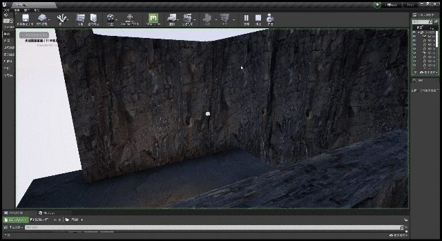
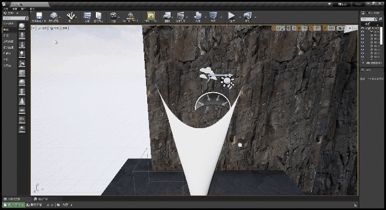

无论是渲染、风力、碰撞等等，都需要法线信息，所以动态生成法线是必须的。  
生成法线的思路就直接用梯度叉乘的方式来计算，参考深度重建法线。  
假设有ABC三点，求这三点构成的面的法线   
$$
\vec{Normal}=normalize(cross(\vec{CA},\vec{CB}))
$$  

而对于下面这种情况，C周围有4个顶点
<div align=center><div>比如布料中非边缘的顶点</div></div>    

则有
$$
\vec{Normal}=normalize(cross(\vec{AE},\vec{BD}))
$$  


# 绘制法线

<div align=center><div>绘制成网格，输出法线方向</div></div>   

<div align=center><div>加一个简单的光照</div></div>    

此处可视化部分写在了[这里](https://zhuanlan.zhihu.com/p/450074927)  

# 风力

不清楚风力模型应该是什么样的，这里就粗略的取风向和顶点法线的点乘吧  
$$
\vec{F_{wind}}=|dot(\vec{Normal}, \vec{Wind})| * \vec{Wind} * Intensity
$$  

在上一章中的重力ComputeShader上添加风力
```cpp
Buffer<float4> InputPositionBuffer;
Buffer<float4> NormalBuffer;

RWBuffer<float4> OutputPositionBuffer;
RWBuffer<half4> VelocityBuffer;
RWBuffer<uint> MaskBuffer;

//x: 重力加速度；y: DeltaTime
float4 ExternalForceParams;

//xyz: 方向 w: 强度
float4 WindParams;

[numthreads(32, 1, 1)]
void MainCS(uint3 ThreadId : SV_DispatchThreadID) {
    uint Mask = MaskBuffer[ThreadId.x];

    if (Mask != 1)
    {
        float3 Normal = NormalBuffer[ThreadId.x].xyz;
        float3 Velocity = VelocityBuffer[ThreadId.x].xyz;
        float g = ExternalForceParams.x;
        float DeltaTime = ExternalForceParams.y;
        
        //重力
        Velocity.z -= g * DeltaTime;

        //风力
        Velocity += abs(dot(WindParams.xyz, Normal)) * WindParams.xyz * WindParams.w * DeltaTime;

        float3 Position = InputPositionBuffer[ThreadId.x].rgb;
        OutputPositionBuffer[ThreadId.x] = float4(Position + Velocity * DeltaTime, 0.0);
        VelocityBuffer[ThreadId.x] = half4(Velocity, 1.0);
    }
}
```

<div align=center><div>比之前的多加了3个固定点，有种窗帘的感觉</div></div>    

<div align=center><div>添加纹理</div></div>    


