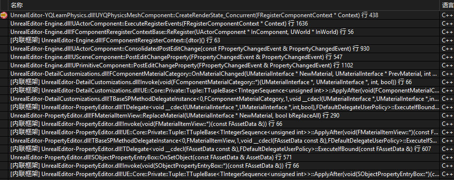
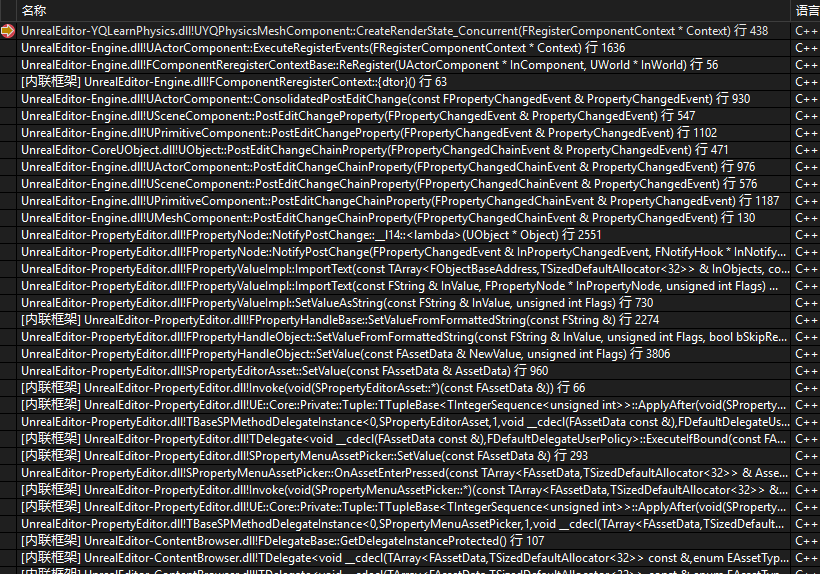

<div align=center><div>更换材质时</div></div>   

<div align=center><div>更换StaticMesh时</div></div>   


都经过了`ReRegister`  
```cpp
void FComponentReregisterContextBase::ReRegister(UActorComponent* InComponent, UWorld* InWorld)
{
	check(InComponent);
		
	if( IsValid(InComponent) )
	{
		// Set scene pointer back
		check(InWorld != NULL); // If Component is set, World should be too (see logic in constructor)

		if( InComponent->IsRegistered() )
		{
			// The component has been registered already but external code is
			// going to expect the reregister to happen now. So unregister and
			// re-register.
			UE_LOG(LogActorComponent, Log, TEXT("~FComponentReregisterContext: (%s) Component already registered."), *InComponent->GetPathName());
			InComponent->ExecuteUnregisterEvents();
		}

		InComponent->WorldPrivate = InWorld;
		FNavigationLockContext NavUpdateLock(InWorld);

		// Will set bRegistered to true
		InComponent->ExecuteRegisterEvents();

		UpdateAllPrimitiveSceneInfosForSingleComponent(InComponent, ScenesToUpdateAllPrimitiveSceneInfos);
	}
}
```

所以会先调用`ExecuteUnregisterEvents`进而`DestroyPhysicsState`并`DestroyRenderState_Concurrent`   

此处的`ExecuteRegisterEvents`也没什么参数，所以根据此处来分清楚是哪一种属性变更导致的重新注册是不可能的   

所以应该从`PostEditChangeProperty`和`PostEditChangeChainProperty`着手  

比如  
```cpp
void UPrimitiveComponent::PostEditChangeChainProperty(FPropertyChangedChainEvent& PropertyChangedEvent)
{
	const FName NAME_Scale3D(TEXT("Scale3D"));
	const FName NAME_Scale(TEXT("Scale"));
	const FName NAME_Translation(TEXT("Translation"));

	for( FEditPropertyChain::TIterator It(PropertyChangedEvent.PropertyChain.GetHead()); It; ++It )
	{
		if( It->GetFName() == NAME_Scale3D		||
			It->GetFName() == NAME_Scale		||
			It->GetFName() == NAME_Translation	||
			It->GetFName() == NAME_Rotation)
		{
			UpdateComponentToWorld();
			break;
		}
	}

	Super::PostEditChangeChainProperty( PropertyChangedEvent );
}
```

比如拖动时`UPrimitiveComponent::PostEditChangeChainProperty`以及最后的`UActorComponent::ConsolidatedPostEditChange`就不会被调用，但是在面板中修改transform就会被调用   


`UStaticMeshComponent::PostEditChangeProperty`里面会通过判断修改的是否是StaticMesh而重建PhysicsState。但是，最后还是会调用`ExecuteRegisterEvents`进而创建PhysicsState的，所以这里的`RecreatePhysicsState`好像没有卵用。当然，如果是运行时调用的`SetStaticMesh`进而调用`RecreatePhysicsState`那还是有用的    