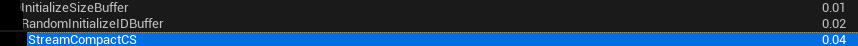
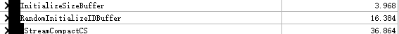
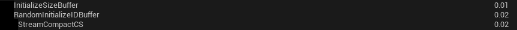
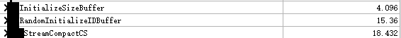

决定在UE中搞一个Reduction出来，用作stream compact  
以前发了[UE4阅读笔记-Niagara&Warp指令](https://zhuanlan.zhihu.com/p/450586745)，但还是决定用非warp指令的方式搞一个出来  
至于我为什么要搞这个。。。。

<div align=center><div>所谓的依赖路径吧</div></div>  


主要就是希望在碰撞侦测之后，生成的碰撞约束数据流是紧凑的   
此处不会有什么难的，因为是我自己写着玩   
# 还是UE的NiagaraComputeFreeIDs.usf
UE提供了两种归约方式来得到空闲粒子ID列表，一种是之前介绍过的使用warp(wave)指令的方式，另一种就是shared memory的方式  
题外话: 在UE4.27中，warp指令的模式是固定的、在某些平台开启(不包括PC)，而在UE5中，变成了根据FeatureLevel来开启。  


首先是向shared memory写入buffer的数据(此处是将粒子是否空闲写入)  
```cpp
// Evaluate predicate for each input slot, then shift down by one position because we need an exclusive sum.
if(Thread > 0)
{
    uint IsFree = (IDToIndexTable[ParticleID - 1] == -1) ? 1 : 0;
    GroupWriteOffsets[Thread] = IsFree;
}
else
{
    GroupWriteOffsets[0] = 0;
}
GroupMemoryBarrierWithGroupSync();
```  
粗略来看，就是每个线程判断对应的粒子是否空闲后写入sm之后同步。但能发现，线程0的场合，默认是0，而其他线程读到的数据都是线程`Id - 1`对应的数据，也就是说，向'右'移了一个位置。   
看注释能发现，UE这里实现的是一个`exclusive sum`。  
什么是  `exclusive sum` ?

>The scan just defined is an exclusive scan, because each element j of the result is the sum of all elements up to but not including j in the input array. In an inclusive scan, all elements including j are summed. An exclusive scan can be generated from an inclusive scan by shifting the resulting array right by one element and inserting the identity. 

`exclusive sum`指的是求前缀和时，输出 $i$不包括输入 $i$。而这里的实现通过向右移了一个位置，来实现`exclusive sum`   

接下来是一个经典$log_2N$的归约，每次循环都从sm中读取两个数据加和
```cpp
int OutBuffer = 0, InBuffer = 1;

[unroll]
for(uint Offset = 1; Offset < THREAD_COUNT; Offset = Offset << 1)
{
    // Swap the input and output buffers.
    OutBuffer = 1 - OutBuffer;
    InBuffer = 1 - InBuffer;
    if(Thread >= Offset)
    {
        GroupWriteOffsets[OutBuffer*THREAD_COUNT + Thread] = GroupWriteOffsets[InBuffer*THREAD_COUNT + Thread - Offset] + GroupWriteOffsets[InBuffer*THREAD_COUNT + Thread];
    }
    else
    {
        GroupWriteOffsets[OutBuffer*THREAD_COUNT + Thread] = GroupWriteOffsets[InBuffer*THREAD_COUNT + Thread];
    }
    GroupMemoryBarrierWithGroupSync();
}
```  
这里的实现相当于时用了两个shared memory的buffer，每次loop都交换。只不过这两个buffer是连续在一起的，每个buffer的长度都是THREAD_COUNT，所以只要使用时，选择起始位置是 `0`还是 `THREAD_COUNT`，就能交换buffer。  

刚刚相当于是在线程组内求了前缀和，接下来是做一个全局的线程组间同步
```cpp
if(Thread == 0)
{
    // Add the value of the last predicate to get the total number of IDs that this group will write.
    uint LastIsFree = (IDToIndexTable[InputStart + THREAD_COUNT - 1] == -1) ? 1 : 0;
    uint NumGroupFreeIDs = GroupWriteOffsets[(OutBuffer + 1)*THREAD_COUNT - 1] + LastIsFree;
    // Add to the global write offset. The previous offset is where we start writing in the output buffer.
    InterlockedAdd(RWFreeIDListSizes[FreeIDListIndex], NumGroupFreeIDs, GroupWriteStart);
}
GroupMemoryBarrierWithGroupSync();
```
这里做的是将当前线程组中空闲粒子的数量用原子操作加和，这样就能得到当前线程组写入到输出buffer时，需要的起始位置。  
求完前缀和之后，sm中最后一个位置的数据就是所有数据的加和。  
但由于采用的是`exclusive sum`，所以是没有统计最后一个位置自身的数据的，所以在此处要判断一下最后一个数据是否空闲。   

现在得到了整个线程组的输出起始位置，也得到了每个线程的元素对应的线程组内的位置，加到一起就是最终的全局输出位置。  
```cpp
if(IDToIndexTable[ParticleID] == -1)
{
    // This is a free ID, output it.
    // GroupWriteStarts 是全局的，当前线程组的起始输出位置
    uint WriteOffset = GroupWriteStart + GroupWriteOffsets[OutBuffer*THREAD_COUNT + Thread];

    RWFreeIDList[WriteOffset] = ParticleID;
}
```  
# 测试性能

个人用的是RTX3070，在`1024x1024=1048576`长度的，每个线程组64个线程

<div align=center><div>使用引擎自带的ProfileGPU</div></div>  

<div align=center><div>使用RenderDoc</div></div>  

看起来0.04ms应该是个较为准确的值

# 尝试改进
之前在[UE引擎中的GPUSort 基数排序](https://zhuanlan.zhihu.com/p/452636510)中提到了所谓的Raking式归约。虽然还未理解其真谛，不过增加每个线程的串行工作量我倒是懂了。   
我们可以做个小小的尝试，每个线程处理 $M$个元素。  

```cpp
uint IsFreeArray[COUNTER_PER_THREAD];
uint NumFreeInThread = 0;

[unroll]
for (uint i = 0; i < COUNTER_PER_THREAD; i++) 
{
    uint IsFree = IDToIndexTable[ParticleID + i] == -1 ? 1 : 0;
    IsFreeArray[i] = IsFree;
    NumFreeInThread += IsFree;
}

GroupWriteOffsets[Thread] = NumFreeInThread;
```  
每个线程读取`COUNTER_PER_THREAD`个数据，并将这些数据中空闲的个数写入shared memory，然后和上面的方式类似。  
测试一下耗时，`COUNTER_PER_THREAD`选为 `8`

<div align=center><div>使用引擎自带的ProfileGPU</div></div>  

<div align=center><div>使用RenderDoc</div></div>  


能看出优化的效果了，从36微秒降到了18微秒

# 一个问题
进行stream compact倒是没问题，但是这种做法需要在输出buffer上预留足够的空间。比如计算 N个物体的碰撞，那我可能需要$N^2$级别的size。这种不定长的问题要怎么搞？或许内存分配也在GPU上搞定？  