说到物理模拟就想到碰撞，说到碰撞就想到空间分割，说到空间分割就想到BVH。这次我来分享一下在UE5实现简单的基于GPU的BVH构建。  

本文参照的是[Maximizing Parallelism in the Construction of BVHs, Octrees, and k-d Trees](https://research.nvidia.com/sites/default/files/publications/karras2012hpg_paper.pdf)。这篇分两个pass来构建BVH，第一个pass构建树的结构，第二个pass构建包围盒。一个亮点是在构建树结构的时候不需要归约，而是完全的并行，也就是每一个内节点对应一个线程；当然在构建包围盒的时候，还是要从底向上构建的。     

这篇论文知乎上有人做了分享  

[https://zhuanlan.zhihu.com/p/423351818](https://zhuanlan.zhihu.com/p/423351818)

<div align=center>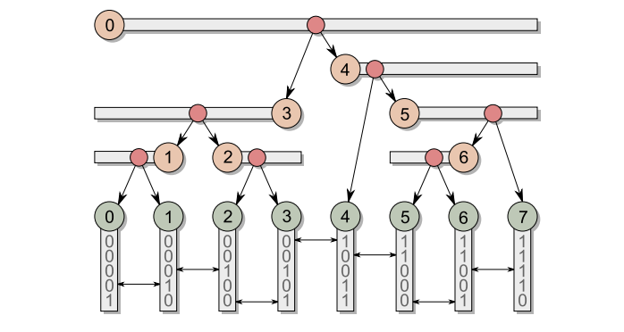<div>节点布局，内节点在竖直方向和一个叶子节点对应；莫顿码的二进制位暗示了两个节点分裂的层级</div></div>   

其实最开始我参照的是[Fast and Simple Agglomerative LBVH Construction](http://diglib.eg.org/bitstream/handle/10.2312/cgvc.20141206.041-044/041-044.pdf?sequence=1)，但是实现的不太好，就换了一篇看，之后有时间再比对一下。  


# 在UE中获取Mesh数据

本文中，我打算令一个网格体的每一个三角形都对应BVH中一个叶子节点，所以我需要获得网格的IndexBuffer和VertexBuffer(只要位置)。要注意的是，在UE中，IndexBuffer可能是16位，也可能是32位。  

<div align=center>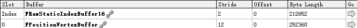<div>用RenderDoc截帧样例中的模型，能够看到Buffer的format，此处的IndexBuffer是R16_UINT</div></div>  

```CPP
UStaticMesh* StaticMesh = StaticMeshComponent->GetStaticMesh();
FStaticMeshRenderData* RenderData = StaticMesh->GetRenderData();

FStaticMeshLODResources& StaticMeshResourceLOD0 = RenderData->LODResources[0];

FStaticMeshSectionArray& StaticMeshSectionArray = StaticMeshResourceLOD0.Sections;

FRawStaticIndexBuffer& MeshIndexBuffer = StaticMeshResourceLOD0.IndexBuffer;
FBufferRHIRef IndexBufferRHI = MeshIndexBuffer.IndexBufferRHI;
bool bIsIndexBuffer32 = MeshIndexBuffer.Is32Bit();

FStaticMeshVertexBuffers& MEshVertexBuffers = StaticMeshResourceLOD0.VertexBuffers;
FBufferRHIRef VertexBufferRHI = MEshVertexBuffers.PositionVertexBuffer.VertexBufferRHI;
```  

在UE5中，IndexBuffer和VertexBuffer都是同一类，而在之前的一些版本中是不同的。  


# 生成莫顿码
我们可以将3维坐标转化为1D的莫顿码，这里我参考UE的做法，调用UE内置的函数`MortonCode3`，位于`/Engine/Private/MortonCode.ush`。   
使用之前，要先对坐标进行缩放，转化到[0, 1023]区间，参考bullet3的[代码](https://github.com/bulletphysics/bullet3/blob/master/src/Bullet3OpenCL/BroadphaseCollision/kernels/parallelLinearBvh.cl)。   

```cpp	
float3 RelativePosition = Position - Center;		// 叶子图元的位置减去最外层包围盒中心

float3 LocalPos = RelativePosition / Extent;    	// 除以最外层包围盒尺寸的一半，缩放到(-1, 1)
LocalPos = LocalPos * 0.5 + 0.5;                    // (0.0, 1.0)
LocalPos = clamp(LocalPos, 0.0, 1.0);
LocalPos = LocalPos * 1024;

int3 DiscretePosition = (int3)LocalPos;

uint Morton;
Morton = MortonCode3(DiscretePosition.x);
Morton |= MortonCode3(DiscretePosition.y) << 1;
Morton |= MortonCode3(DiscretePosition.z) << 2;
```

其中网格的`Center`和`Extent`可以直接从`UStaticMesh`中获取，我就不自己算了。   

# GPU上的排序

UE引擎中实现了GPU上的基数排序，我这里直接拿来用，之前我也写过简略的介绍     
[UE引擎中的GPUSort 基数排序](https://zhuanlan.zhihu.com/p/452636510)   

看一下DownSweep步骤中的资源  
```cpp
/** Input keys to be sorted. */
Buffer<uint> InKeys;
/** Input values to be transferred with keys. */
Buffer<uint> InValues;
/** Input offsets. */
Buffer<uint> InOffsets;
/** Output buffer for sorted keys. */
RWBuffer<uint> OutKeys;
/** Output buffer for sorted values. */
RWBuffer<uint> OutValues;
```   
Value缓冲默认是uint类型，这里我个人选择用一个递增的序号数组作为输入的Value缓冲，用来标记排序前后位置变化，以便将BV的位置信息拷贝到排序后的位置。  

看一下函数`SortGPUBuffers`，实现位于`GPUSort.cpp`  
```cpp
struct FGPUSortBuffers
{
	/** Shader resource views for vertex buffers containing the keys. */
	FRHIShaderResourceView* RemoteKeySRVs[2];
	/** Unordered access views for vertex buffers containing the keys. */
	FRHIUnorderedAccessView* RemoteKeyUAVs[2];

	/** Shader resource views for vertex buffers containing the values. */
	FRHIShaderResourceView* RemoteValueSRVs[2];
	/** Unordered access views for vertex buffers containing the values. */
	FRHIUnorderedAccessView* RemoteValueUAVs[2];

	/** Shader resource view holding the initial state of the values. */
	FRHIShaderResourceView* FirstValuesSRV = nullptr;	//nullptr的场合就使用BufferIndex对应的Buffer
	/** Unordered access view holding the final state of the value. */
	FRHIUnorderedAccessView* FinalValuesUAV = nullptr;
};

int32 SortGPUBuffers(
    FRHICommandList& RHICmdList
    , FGPUSortBuffers SortBuffers   // key和value的buffer
    , int32 BufferIndex             // 开始时含有输入值的buffer序号，0或1
    , uint32 KeyMask                // 
    , int32 Count                   // 
    , ERHIFeatureLevel::Type FeatureLevel
)
```  
这个排序算法需要多pass进行pingpang运算，BufferIndex会在0和1之间交换
```cpp
// Flip buffers.
BufferIndex ^= 0x1;
```

做个测试，显卡是RTX3070
<div align=center><div>1922个元素，0.14ms，数据量有点小</div></div>   

<div align=center>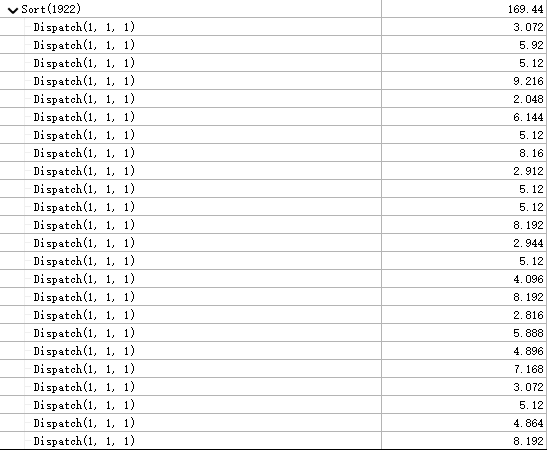<div>RenderDoc看一下，因为采用Raking模式，单个线程要处理很多元素，因而线程组数量较少</div></div>   

尝试将`KEYS_PER_LOOP`参数从`8`改为`4`，减少单个线程的计算量
<div align=center>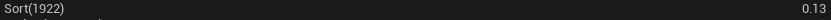<div>不过影响不大，可能用默认的参数就行</div></div>   

# 构建树结构
<div align=center><div>看着这张图会比较容易理解</div></div>   
对每一个内节点启动一个线程

<div align=center>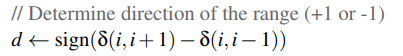<div></div></div>  

决定范围的方向，如果一个内节点是左子节点，那它的方向就是左，也就是 -1，反之是 1。以图中叶子节点3为例，$\delta(3,4)$比$\delta(3,2)$要小，那么叶子节点3和2相比3和4要在更下层才分裂，形象的说，相比3和4，3和2更可能是同一个内节点的后代。  

<div align=center>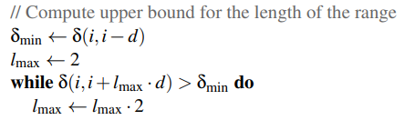<div></div></div>  

用2的指数粗略的寻找子孙节点范围的长度。以内节点3为例，$\delta_{min}=\delta(3,4)$，因为内节点3和4是在更上一级分裂的，所以公共前缀长度比内节点3范围内的都要小。  
文中这里提到以一个更大的初始长度寻找会更有效率
>we have found that it is beneficial to start from a
larger number, e.g. 128, and multiply the value by 4 instead
of 2 after each iteration to reduce the total amount of work


<div align=center>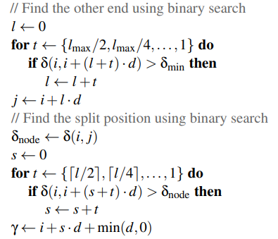<div></div></div>  

二叉搜索找出精确的范围长度以及边界的id，之后再二叉找出分裂点

<div align=center>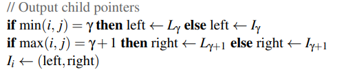<div></div></div>  

输出结果，这里要区分子节点是内节点 $I$还是叶子节点 $L$。  

逻辑还是比较容易理解的，不过有几个要注意的地方。

## 计算delta值
计算delta值，也就是文中的 $\delta(i, j)$的时候，当 i,j超过范围，则结果为 -1，我一开始没注意，给了 0。   
当 $k_i=k_j$时，两个莫顿码相同时，可以用 id拓展莫顿码，就像append一个字符串一样，用拓展后的key去计算 $\delta$。当然其实直接去计算两个节点的 id的公共前缀长度就像，不需要真的用拓展后的key去计算。   

## 二叉搜索
搜索子孙节点范围的这一步，因为 $l_{max}$是 2的幂，所以可以一直除以 2来得到搜索的步进值。下一步，里面的 $l$就不能这么做了。  


# 向上构建包围盒
有了树的结构之后，就可以从叶子节点不断向上合并包围盒。这里文中给出了一种向上合并的方式：
> We track how many threads have visited each internal node
using atomic counters—the first thread terminates immediately while the second one gets to process the node.

通过原子加操作累计有多少个线程访问了内节点，第一个访问内节点的线程退出，第二个线程继续向上。这样可以保证每一个内节点只被一个线程处理，也就是O(n)。   

在我看来，这也同时解决了线程间同步的问题，使用`DeviceMemoryBarrier()`之后的这种操作，能够确保第二个线程合并包围盒时，第一个线程写入的值是可读的。不过原文是用CUDA实现，可能直接就使用全局的同步语句了。    

文中还提到通过判断叶子节点是否在同一个线程组进而来用shared memory的原子操作来优化效率，不过我还没实现这个优化。  

# 结果

<div align=center>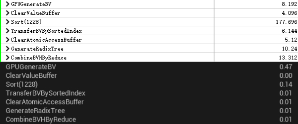<div>1228个三角形</div></div>  


<div align=center>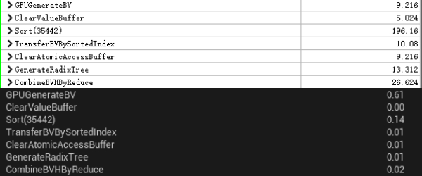<div>35442个三角形</div></div>  

可以看出最大的消耗是排序，这一点也和论文中一样。手头没有面数多的模型，就先随便拿两个试了试。   

# 可视化
<div align=center>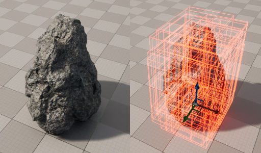<div>效果图</div></div>   

我希望能够可视化某一深度的节点，这要解决两个问题  
* 如何在UE引擎中插入一个自定义pass
* 如何得到可视化节点的列表 
## 插入自定义pass
因为是在GPU上的BVH，所以使用自定义的vs和ps来可视化比较合适。在过去，添加一个自定义的pass可能需要修改引擎，但是自从UE新增了SceneViewExtension，我们就可以在插件里面修改渲染管线。   
比如在BasePass之后绘制一个简单的线框cube，可以通过继承SceneViewExtension并实现`PostRenderBasePass_RenderThread`函数，就可以在渲染管线的BasePass之后插入我们的渲染指令。  

<div align=center>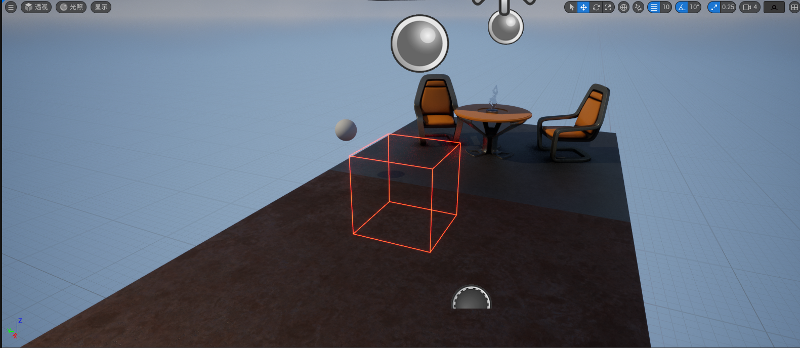<div>在BasePass之后绘制的线框</div></div>  

## 得到可视化节点的列表
因为树的形状是不确定的，所以某一深度的节点的数量是未知的，也就难以用`DrawPrimitive`指令来绘制指定数量的图元。   
我这里选择用`DrawPrimitiveIndirect`，在绘制之前，先用计算着色器遍历BVH，将需要绘制的节点的ID输出到buffer，同时统计这些节点的数量，将`DrawPrimitiveIndirect`需要的参数写入参数Buffer。   

应该也可以用几何着色器或者从显存拷贝节点数量到cpu内存。    

遍历BVH的时候，用 $2^{depth}$数量的线程，如果某一线程还没到所需的深度就已经到达叶子节点了，那么这个线程的count就是0，不然就是1，然后通过求前缀和的方式，就能得知当前线程写入buffer的地址，同时最后的前缀和也就是节点的数量。   
我写过一篇归约的文章，或许可以参考。  
[https://zhuanlan.zhihu.com/p/452965458](https://zhuanlan.zhihu.com/p/452965458)


# 结尾
BVH相关的文章还是挺多，我用的算法只是早些年的简单的算法，还有有各式各样的改进方向还需要学习。之后也会继续学习关于碰撞检测的知识，有时间会发出来分享。 

# 想到的改进
叶子节点采用三角形，而是hash网格和三角形的结合，这样应该能有效减少构建BVH时的开销  
另一个想法是优化排序

* 看一下CUDA的thrust中排序实现
* 简化DownSweep，不使用InValue缓冲，因为在这个做法中，InValue其实是个`y=x`函数
* 内存占用应该优化一下
