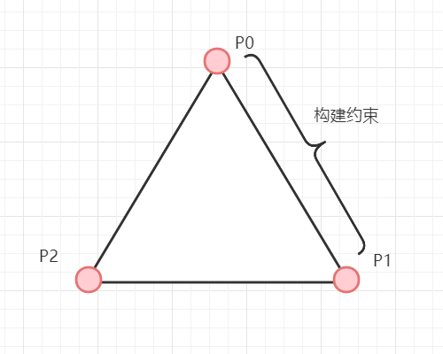
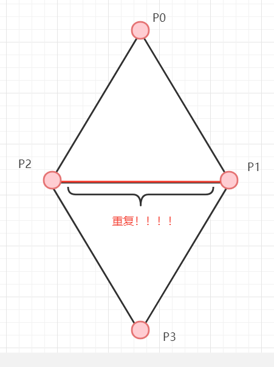
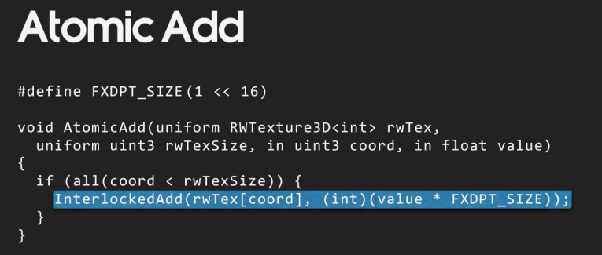
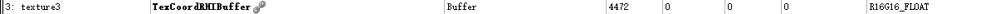

这次要修改以前写的PBD布料      
[物理模拟笔记-0-一个超简单PBD](https://zhuanlan.zhihu.com/p/449897373)   

在之前的实现中，布料网格结构是写死在代码逻辑中，现在我要重构代码，来支持使用StaticMesh生成布料的约束   

# 数据

## Mesh数据
当前我使用顶点色来标注哪些顶点时固定点，使用UE自带的paint工具就能刷顶点色，还算方便，不过理想上物理数据应该和渲染数据分开。   


## 距离约束的Buffer
```cpp
// 距离约束的Buffer
// 粒子A的ID
FRWBuffer DistanceConstraintsParticleAIDBuffer;
// 粒子B的ID
FRWBuffer DistanceConstraintsParticleBIDBuffer;
// 距离Buffer
FRWBuffer DistanceConstraintsDistanceBuffer;
```

# GPU上生成距离约束
这里我用一般的方式，将网格中三角形的一个边视为一个距离约束，也就是使用边上的两个顶点(粒子)和边的长度构建距离约束。边的信息可以从indexbuffer中获取，indexbuffer此处可以是为一个长为 $3N$的数组，$N$指三角形数量，存储顶点的id，每3个顶点构成一个三角形。   

<div align=center><div>每个边生成一个距离约束</div></div>   

不过此处的一个问题在于，很多时候两个三角形会共享一个边，如果不加处理，会生成重复的距离约束。   

<div align=center><div>共享边</div></div>   

我这里的解决方式是实现一个去重算法，来将有重复key的buffer压缩为无重复key的buffer。算法借鉴了一下[tensorflow的实现](https://github.com/tensorflow/tensorflow/blob/master/tensorflow/core/kernels/unique_op_gpu.cu.h)。   

去重算法的大概流程  
* [3, 5, 3, 4, 1, 4, 9, 8, 6, 3, 5, 7, 8, 8, 4, 6, 4, 2, 5, 6] -- 0
* 排序，得到排序后的buffer，  
  [1, 2, 3, 3, 3, 4, 4, 4, 4, 5, 5, 5, 6, 6, 6, 7, 8, 8, 8, 9] -- 1  
* 对buffer-1 判断一个位置是否是连续相同数据(segment)的边界，其实就是判断左边的数据和自己是否相同   
  [1, 1, 1, 0, 0, 1, 0, 0, 0, 1, 0, 0, 1, 0, 0, 1, 1, 0, 0, 1] -- 2
* 对buffer-2 进行归约操作就能得到每个标为1的值的输出位置，进而将buffer压缩成unique的

这里的排序，我是使用UE中的GPU基数排序   
[UE引擎中的GPUSort 基数排序](https://zhuanlan.zhihu.com/p/452636510)   

大概代码就是
```cpp
// 依据indexbuffer，每一个边生成一个key
GenerateDistanceConstraintsKeyFromMesh(...);    

// 对key进行排序，这里不需要value
int32 BufferIndex = SortGPUBuffers(
    RHICmdList
    , GPUSortBuffers
    , 0
    , 0xFFFFFFFF
    , NumTriangles * 3
    , ERHIFeatureLevel::SM5
);

// 对排序后的key进行去重(求前缀和)
CompactSortedKey(...);

// 根据key来得到原本的边的信息，来构造距离约束
GenerateDistanceConstraintsByCompactKey(...);
```
GPU上求前缀和的算法网上很多，我也写过一篇     
[UE引擎中的归约算法](https://zhuanlan.zhihu.com/p/452965458)
# 弯曲约束
我这里的弯曲约束的生成和距离约束的生成算法很像，都是基于两个三角形共享一条边这个前提来做。区别在于生成弯曲约束的时候，不仅仅是对key进行排序，而是key-value对，value中记录这三角形的id。这样，就能在去重之后得知两个有共享边的三角形的id，进而知道弯曲约束的四个点。   

下面用边的key的buffer距离，value的buffer也就是三角形id略去
* [3, 5, 4, 1, 9, 8, 6, 3, 7, 8, 4, 2, 5, 6] -- 0
* 排序，得到排序后的buffer，  
  [1, 2, 3, 3, 4, 4, 5, 5, 6, 6, 7, 8, 8, 9] -- 1  
* 对buffer-1 判断左边的数据是否和自己相同，相同为 1 (和距离约束不同)   
  [0, 0, 0, 1, 0, 1, 0, 1, 0, 1, 0, 0, 0, 0] -- 2
* 对buffer-2 进行归约操作，同时将key对应的value输出


# 刚性

# 约束投影
此处的一个问题在于，我是将约束数据存成了buffer，相对独立于粒子，在计算矫正值的时候，是每个线程对应一个约束。也就是说，可能有多个gpu线程影响一个粒子的位置。   
一般情况下，会使用原子操作来处理这种情况，但是我使用的是计算着色器，并不支持浮点数的原子操作。   

此处参考了战神4的做法，将浮点数乘以(1<<16)，转为一个有符号整形，来进行原子操作  
<div align=center><div>GDC - Wind Simulation in 'God of War'</div></div>   


# 动态顶点法线
为了能够正常渲染布料或是计算风力、碰撞，我们需要计算出顶点的法线。   
思路是计算出每一个面的法线，然后累积到每个顶点上，最后每个顶点对这个累积量归一化。  

# 动态顶点切线
之前虽然编写了动态计算法线的代码，但是却没有计算切线，这意味着无法使用法线贴图，所以接下来添加一个动态计算切线的功能计算切线的原理参考 [Computing Tangent Space Basis Vectors for an Arbitrary Mesh](http://www.terathon.com/code/tangent.html)。   
要计算法线，我们需要的是三角形的顶点的位置 (和计算法线一样)以及顶点的 UV，UV可以从StaticMesh的RenderData中获取。  

```cpp
FStaticMeshLODResources& StaticMeshResourceLOD0 = RenderData->LODResources[0];
FStaticMeshSectionArray& StaticMeshSectionArray = StaticMeshResourceLOD0.Sections;
FRawStaticIndexBuffer& MeshIndexBuffer = StaticMeshResourceLOD0.IndexBuffer;
FStaticMeshVertexBuffers& MeshVertexBuffers = StaticMeshResourceLOD0.VertexBuffers;

TexCoordBufferSRV = MeshVertexBuffers.StaticMeshVertexBuffer.GetTexCoordsSRV();
```  

<div align=center><div>UE中UV的Buffer，格式是R16G16F</div></div>    


# VertexFactory
为了让顶点着色器能够从buffer中获得计算出来的法线和切线，我们需要在VertexFactory中编写代码，来计算出一个切线空间转到世界空间的矩阵。  
比如说，材质蓝图中的`VertexNormalWS`节点，对应的代码是`Parameters.TangentToWorld[2]`，此处的`TangentToWorld`就是我们要计算出的矩阵。   

在`LocalVertexFactory`中，这个矩阵是先计算出一个`TangentToLocal`矩阵，在将其转换为`TangentToWorld`，不过我之前的计算都是发生在世界空间，所以直接计算`TangentToWorld`就行。   


# UE组件
上面讲的基本都是物理模拟相关的，下面讲一下其他部分的实现   

我个人是希望在插件中实现这些功能，所以我不会去修改引擎的代码。因此我创建了一个新的Component，继承`UMeshComponent`并实现自己的`SceneProxy`和`VertexFactory`，这样我可以在渲染时，读取动态计算出来的buffer来获取位置、法线等数据。    


# VertexFactory
我之前将vf存储在sceneproxy上，但实际上vf应该是和mesh对应的，当材质变更的时候，vf不应该随之重新创建。比如static mesh component的sceneproxy就是引用的staticmesh的`FStaticMeshRenderData`数据，从而获得里面的vf    

# 风力
可以通过`FScene::GetDirectionalWindParameters`获取