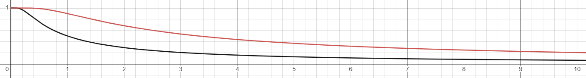

这次要修改以前写的PBD布料      
[物理模拟笔记-0-一个超简单PBD](https://zhuanlan.zhihu.com/p/449897373)   

在之前的实现中，布料网格结构是写死在代码逻辑中，现在我要重构代码，来支持使用StaticMesh生成布料的约束   

# 数据

## Mesh数据
当前我使用顶点色来标注哪些顶点时固定点，使用UE自带的paint工具就能刷顶点色，还算方便，不过理想上物理数据应该和渲染数据分开。   


## 距离约束的Buffer
```cpp
// 距离约束的Buffer
// 粒子A的ID
FRWBuffer DistanceConstraintsParticleAIDBuffer;
// 粒子B的ID
FRWBuffer DistanceConstraintsParticleBIDBuffer;
// 距离Buffer
FRWBuffer DistanceConstraintsDistanceBuffer;
```

# GPU上生成距离约束
这里我用一般的方式，将网格中三角形的一个边视为一个距离约束，也就是使用边上的两个顶点(粒子)和边的长度构建距离约束。边的信息可以从indexbuffer中获取，indexbuffer此处可以是为一个长为 $3N$的数组，$N$指三角形数量，存储顶点的id，每3个顶点构成一个三角形。   

<div align=center><div>每个边生成一个距离约束</div></div>   

不过此处的一个问题在于，很多时候两个三角形会共享一个边，如果不加处理，会生成重复的距离约束。   

<div align=center><div>共享边</div></div>   

我这里的解决方式是实现一个去重算法，来将有重复key的buffer压缩为无重复key的buffer。算法借鉴了一下[tensorflow的实现](https://github.com/tensorflow/tensorflow/blob/master/tensorflow/core/kernels/unique_op_gpu.cu.h)。   

去重算法的大概流程  
* [3, 5, 3, 4, 1, 4, 9, 8, 6, 3, 5, 7, 8, 8, 4, 6, 4, 2, 5, 6] -- 0
* 排序，得到排序后的buffer，  
  [1, 2, 3, 3, 3, 4, 4, 4, 4, 5, 5, 5, 6, 6, 6, 7, 8, 8, 8, 9] -- 1  
* 对buffer-1 判断一个位置是否是连续相同数据(segment)的边界，其实就是判断左边的数据和自己是否相同   
  [1, 1, 1, 0, 0, 1, 0, 0, 0, 1, 0, 0, 1, 0, 0, 1, 1, 0, 0, 1] -- 2
* 对buffer-2 进行归约操作就能得到每个标为1的值的输出位置，进而将buffer压缩成unique的

这里的排序，我是使用UE中的GPU基数排序   
[UE引擎中的GPUSort 基数排序](https://zhuanlan.zhihu.com/p/452636510)   

大概代码就是
```cpp
// 依据indexbuffer，每一个边生成一个key
GenerateDistanceConstraintsKeyFromMesh(...);    

// 对key进行排序，这里不需要value
int32 BufferIndex = SortGPUBuffers(
    RHICmdList
    , GPUSortBuffers
    , 0
    , 0xFFFFFFFF
    , NumTriangles * 3
    , ERHIFeatureLevel::SM5
);

// 对排序后的key进行去重(求前缀和)
CompactSortedKey(...);

// 根据key来得到原本的边的信息，来构造距离约束
GenerateDistanceConstraintsByCompactKey(...);
```
GPU上求前缀和的算法网上很多，我也写过一篇     
[UE引擎中的归约算法](https://zhuanlan.zhihu.com/p/452965458)
# 弯曲约束

我这里的弯曲约束的生成和距离约束的生成算法很像，都是基于两个三角形共享一条边这个前提来做。区别在于生成弯曲约束的时候，不仅仅是对key进行排序，而是key-value对，value中记录这三角形的id。这样，就能在去重之后得知两个有共享边的三角形的id，进而知道弯曲约束的四个点。   

下面用边的key的buffer举例，value的buffer也就是三角形id略去
* [3, 5, 4, 1, 9, 8, 6, 3, 7, 8, 4, 2, 5, 6] -- 0
* 排序，得到排序后的buffer，  
  [1, 2, 3, 3, 4, 4, 5, 5, 6, 6, 7, 8, 8, 9] -- 1  
* 对buffer-1 判断左边的数据是否和自己相同，相同为 1 (和距离约束不同)   
  [0, 0, 0, 1, 0, 1, 0, 1, 0, 1, 0, 0, 0, 0] -- 2
* 对buffer-2 进行归约操作，同时将key对应的value输出


# 刚性

>We have not considered the type and the stiffness k of
the constraint so far. Type handling is straight forward. If
the type is equality we always perform a projection. If
the type is inequality, the projection is only performed if
C(p1,...,pn) < 0. There are several ways of incorporating
the stiffness parameter. The simplest variant is to multiply
the corrections ∆p by k ∈ [0...1]. However, for multiple
iteration loops of the solver, the effect of k is non-linear.
The remaining error for a single distance constraint after
ns solver iterations is ∆p(1 − k)
ns
. To get a linear relationship we multiply the corrections not by k directly but by
k
0 = 1 − (1 − k)
1/ns
. With this transformation the error becomes ∆p(1−k
0
)
ns = ∆p(1−k) and, thus, becomes linearly
dependent on k and independent of ns as desired. However,
the resulting material stiffness is still dependent on the time
step of the simulation. Real time environments typically use
fixed time steps in which case this dependency is not problematic.


对于刚性，一个简单的假设是材质的刚性除以迭代次数，但是，实际上迭代对结果的影响是非线性的。  
在[Position Based Dynamics](https://matthias-research.github.io/pages/publications/posBasedDyn.pdf)文中给出的一个思路是  

$$
k^`=1-(1-k)^{1/n_s}
$$  

而UE的chaos对其进行了修改，让这个相关于迭代次数的曲线变得更加陡峭，他的公式是   

$$
k^`=1-(1-1000^{k-1})^{1/n_s}
$$  

<div align=center><div>chaos的刚性系数随迭代次数变化更快，更陡峭</div></div>   

# 约束投影
此处的一个问题在于，我是将约束数据存成了buffer，相对独立于粒子，在计算矫正值的时候，是每个线程对应一个约束。也就是说，可能有多个gpu线程影响一个粒子的位置。   
一般情况下，会使用原子操作来处理这种情况，但是我使用的是计算着色器，并不支持浮点数的原子操作。   

此处参考了战神4的做法，将浮点数乘以一个常量 (战神这里是乘以 1<<16)，转为一个有符号整形，来进行原子操作  
<div align=center><div>GDC - Wind Simulation in 'God of War'</div></div>   


# 动态顶点法线
为了能够正常渲染布料或是计算风力、碰撞，我们需要计算出顶点的法线。   
思路是计算出每一个面的法线，然后累积到每个顶点上，最后每个顶点对这个累积量归一化。   
计算面法线的原理十分简单，获取两个边的向量进行叉乘，就能得到一个垂直于面的向量。  
```cpp
float3 Normal = normalize(cross(Position1 - Position2, Position0 - Position2));
```  
为了渲染时能够使用法线纹理，也应该计算出切线来得到TBN矩阵。计算方式我写在了这里。    

[UE笔记-自定义一个UPrimitiveComponent-4-法线纹理](https://zhuanlan.zhihu.com/p/544197465)
 

# 风力

<div align=center><div></div></div>   
