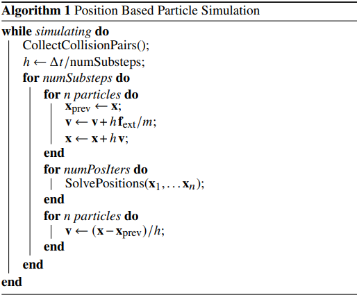

<head>
    
    
</head>  

[Detailed Rigid Body Simulation with Extended Position Based Dynamics](https://www.semanticscholar.org/paper/Detailed-Rigid-Body-Simulation-with-Extended-Based-M%C3%BCller-Macklin/a3034e211b4ea7b66059c85c57a4e6335e56fe07)
# 1 
基于位置的动力学(PBD)[[Position Based Dynamics]](https://matthias-research.github.io/pages/publications/posBasedDyn.pdf)通过直接计算位置来解决这类问题。速度在位置计算后被算出，依据配制可能在时间步前或后。  
`PBD` 大多被用来计算受约束的粒子系统来模拟布料或软体，直到Macklin etal。[[PBF]](https://mmacklin.com/pbf_sig_preprint.pdf) 设计出了一种处理流体的方式。这允许人们去开发在PBD框架下的基于粒子的统一解算器[[Unified Particle Physics for Real-Time Applications]](https://mmacklin.com/uppfrta_preprint.pdf)。他们使用了`形状匹配shape match`的方式，将软体看作联系的粒子的集合来模拟。然而，形状匹配的成本随着粒子数量的增加而增加，冲击传播缓慢且难以处理关节(joint)。一个更有效的方法是将 PBD 扩展到粒子之外，并通过引入旋转状态将刚体模拟为单个实体。Deul et al. [[Position-Based Rigid Body Dynamics]](https://animation.rwth-aachen.de/media/papers/2014-CAVW-PBRBD.pdf)将刚体动力放到了PBD的框架中。   
原始 PBD 方法使用非线性投影 GaussSeidel (NPGS) 方法来求解非线性位置方程。 NPGS 与将常规或投影 Gauss-Seidel (PGS) 方法应用于线性化方程有着根本的不同。 图 2 显示了这种差异。 关键是在解决每个单独的约束后，位置会立即更新。 通过这种方式，PBD 直接处理非线性问题，提高了鲁棒性和准确性。 圆形摩擦锥或与弯曲物体的碰撞很容易处理。 不是将接触存储为对一对对象的引用以及导致接触平面的静态法线，我们只存储引用并在特定接触的每个单独求解之前重新计算法线。 一种较便宜的方法是像传统方法一样存储局部接触几何，但使用高阶近似
由于这些优势，我们的目标是以允许实现完全成熟的刚体引擎但不牺牲其简单性的方式扩展 PBD。  
然而，  
然而，基于以下问题，PBD 以非物理和过于简单化而著称  
* 不使用物理的单位、数量
* 刚性和迭代次数、时间步相关
* 积分不是物理准确的
* 依赖于约束处理的顺序
* 依赖网格的曲面细分
* 收敛慢  

幸运的是，所有这些问题最近都得到了解决，我们提出的求解器是其他方法的有力竞争者，我们将在结果部分展示。  
# 3 
回顾原本的PBD的受约束的粒子系统算法  
## 3.1 粒子模拟循环

    

算法 1 显示了仿真循环。每个时间子步的第一个循环(`for n particles do`)对位置$\vec{x_i}$和速度$\vec{v_i}$显示积分，此处只考虑像是重力这样的外力$\vec{f_{ext}}$。第二个循环实现核心的隐式解算器。程序`"SolvePositions"`
迭代所有的约束(GS或雅可比形式的)并且通过`约束投影`移动粒子的位置，这一部分是主要的焦点。第三个循环用先前位置和当前位置算出速度。Macklin et al.[[Small Steps in Physics Simulation]](http://mmacklin.com/smallsteps.pdf)表明采用子步比求解器迭代更有效，因此`'numPosIters'`通常设置为 1。  

