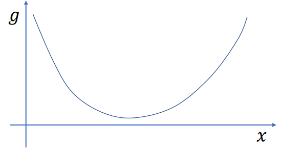
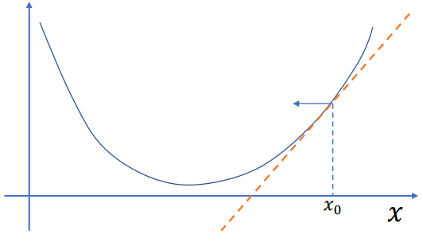
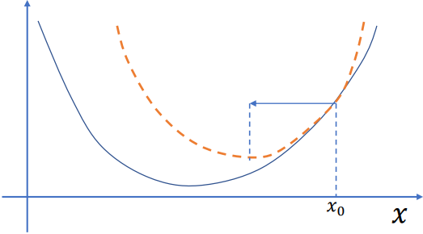

<head>
    
    
</head>  

[太极图形课-弹性物体仿真-02](https://www.bilibili.com/video/BV1nr4y1Q73e)   
对于我这样数学差的人来说挺不错的  
# 隐式积分的数值解法
隐式欧拉：
$$
v_{n+1}=v_n+hM^{-1}f(x_{n+1})\\
x_{n+1}=x_n+hv_{n+1}
$$  
得出
$$
x_{n+1}=x_n+hv_n+h^2M^{-1}f(x_{n+1})
$$  
核心就是求解这个方程。  
## Baraff-Witkin形式的解法
令$\delta _x=x_{n+1}-x_n$ ，泰勒展开得$f(x_{n+1})\approx f(x_n)+\nabla _xf(x_n)\delta _x$  
带入上式得出   

$$
(M-h^2\nabla _xf(x_n))\delta _x=hMv_n+h^2f(x_n)
$$  

也就是一个$Ax=b$ 形式的式子。  
思路来源[Large Steps in Cloth Simulation](https://www.cs.cmu.edu/~baraff/papers/sig98.pdf)   

由于只是泰勒展开了一阶，所以结果如下图所示，解出的$x_{n+1}$和实际的$x_{n+1}$有一定差距，也因此，这种用一阶展开的方式也叫半隐式。

红色的线表示计算出的结果和真正的解的差距

   

## 另一种更准确的解法
$$
x_{n+1}=x_n+hv_n+h^2M^{-1}f(x_{n+1})
$$  
把对这个式子求解，转化为求解其积分的梯度为0  
将$f(x)$视为$\nabla E(x)$，得到积分为  
$$
g(x)=\frac{1}{2}||x-(x_n+hv_n)||^2_M+h^2E(x)
$$  
此处有$||x||_A=\sqrt {x^TAx}$  
梯度为  
$$
\nabla _xg(x_{n+1})=M(x_{n+1}-(x_n+hv_n))-h^2f(x_{n+1})
$$  
此时问题就转化为求解$\nabla _xg(x_{n+1})=0$，也就是求argmin  
### 求解 凸函数最小值问题 min g(x)  
看起来也是个经典的数学问题，凸优化。很多问题都可以转为凸优化问题。    
先假设$g(x)$是一个凸函数，$x_0$是当前的位置，需要知道在$x_0$处向哪个方向移动，移动多远，到达最小值处。  

假设的函数图像，虽然是凹的，但叫凸函数。

   

一个方式是求梯度来判断方向，$dx=-\nabla _xg(x)$  

   

另一个方式是牛顿法，求二阶导数，$dx=-(\nabla ^2_xg(x))^{-1}\nabla _xg(x)$  

牛顿法的事实上是前进到一个和g(x)相切的函数的最小值处

   

这两种方式能够得出方向，随后就是步进，有点像ray-march  
此处课程给出了[一个凸优化课程的链接](https://web.stanford.edu/~boyd/cvxbook/)   
# 线性系统求解