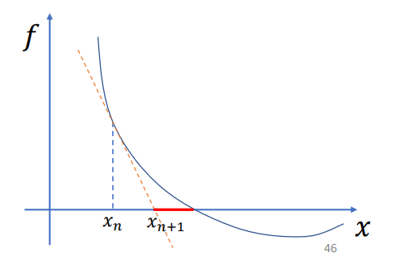

[太极图形课-弹性物体仿真-02](https://www.bilibili.com/video/BV1nr4y1Q73e)   
对于我这样数学差的人来说挺不错的  
# 隐式积分的数值解法
隐式欧拉：
$$
v_{n+1}=v_n+hM^{-1}f(x_{n+1})\\
x_{n+1}=x_n+hv_{n+1}
$$  
得出
$$
x_{n+1}=x_n+hv_n+h^2M^{-1}f(x_{n+1})
$$  
核心就是求解这个方程。  
## Baraff-Witkin形式的解法
令$\delta _x=x_{n+1}-x_n$，泰勒展开得$f(x_{n+1})\approx f(x_n)+\nabla _xf(x_n)\delta _x$  
带入上式得出  
$$
(M-h^2\nabla _xf(x_n))\delta _x=hMv_n+h^2f(x_n)
$$  
也就是一个$Ax=b$ 形式的式子。  
思路来源[Large Steps in Cloth Simulation](https://www.cs.cmu.edu/~baraff/papers/sig98.pdf)   

由于只是泰勒展开了一阶，所以结果如下图所示，解出的$x_{n+1}$和实际的$x_{n+1}$有一定差距，也因此，这种用一阶展开的方式也叫半隐式。

红色的线表示计算出的结果和真正的解的差距

   

## 另一种更准确的解法
