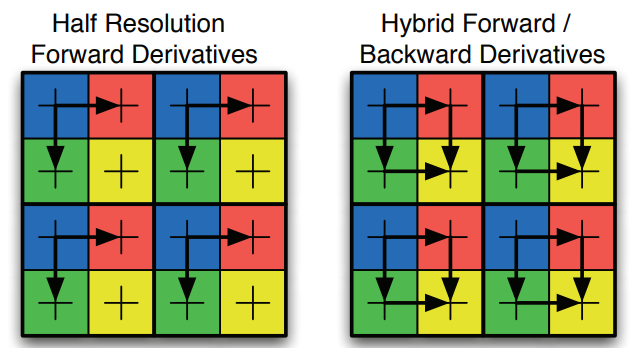
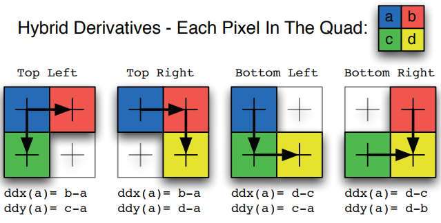

最近看了FSR，发现Quad间通信是个可以研究研究的东西，但是又没有发现大规模的使用，或许是有缺点？  
研究过程中看到了这个 [shadertoy CAS Filter in 1 Tap](https://www.shadertoy.com/view/wlGyzt)，利用ddx和ddy获取quad中临近线程的值。    
其中提到了`GPU Pro 2` 的章节 `Shader Amortization using Pixel Quad Message Passing`，应该指的是利用PixelQuad的通信来平摊一些成本。主要利用的是`ddx` 和`ddy`。 
# 内容提炼

<div align=center><div>在现代硬件中实际使用的微分计算。 我们发现导数要么使用前向差分以半分辨率计算，要么使用前向和后向差分的混合。</div></div>   

<div align=center><div>在混合情况下，我们分解了每个像素的导数。</div></div>   

从这里来看，有些硬件会是前面的那种？那就意味着右下角的像素无法拿到临近像素的值。这显然需要测试。  
在混合方式中，ddx、ddy都是简单地将邻近pixel作差。基于此，我们能够简单地得到临近pixel的值。  
比如对于左上角的pixel   
$$
a+ddx(a)=a+(b-a)=b
$$  
对于右上角的pixel   
$$
b-ddx(b)=b-(b-a)=a
$$  
改成通用的形式  
$$
h=v-sign_x *ddx(v)
$$  

```cpp
//获得quad中其余三个float4
void QuadGather2x2( 
    float4 value ,
    out float4 horz,
    out float4 vert,
    out float4 diag 
)
{
    horz = value + ddx(value) ∗ QuadVector.z ;  // 水平的
    vert = value + ddy(value) ∗ QuadVector.w;   // 竖直的
    diag = vert + ddx(vert) ∗ QuadVector.z ;    // 对角线
}
```  
```cpp
//类似于Gather4指令
float QuadGather2x2(float value)
{
    float4 r = value;
    r.y = r.x + ddx(r.x) ∗ QuadVector.z ; // 水平的
    r.zw = r.xy + ddy(r.xy) ∗ QuadVector.w; // z竖直的 w对角线
    return r ;
}

```
```cpp
//计算QuadVector，判断当前像素位于quad中哪一个位置
void InitQuad(float2 screenCoord)
{
    ScreenCoord = screenCoord ;
    QuadVector = frac(screenCoord.xy ∗ 0.5).xyxy;
    QuadVector = QuadVector ∗ float4 (4, 4, −4, −4) + float4 (−1, −1, 1, 1);
    QuadSelect = saturate(QuadVector) ;
}
```
这种用法应该是限于前向和后向差分的混合的方式。   
后面讲到了集中应用，PCF、Blur、 Cross Bilateral Sampling。


在UE4中可以搜到`PixelQuadMessagePassing.ush`，提供了几个获取临近像素的函数，在Tonemap中能看到调用(UE4.24)。  
不过只有一次获取一个float的，没有一次获取float4的，不清楚为何，可能是考虑Tonemap的输入是HDR纹理？
